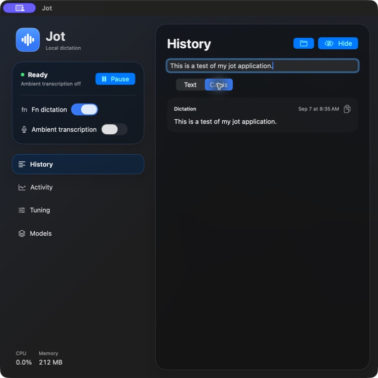
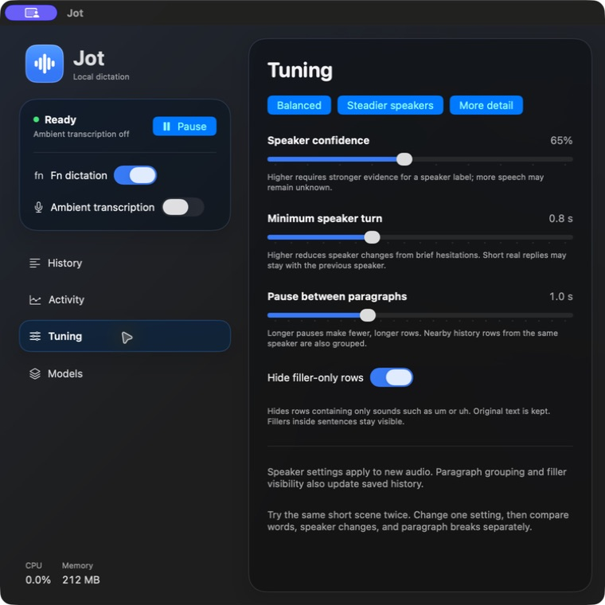

<p align="center">
  
</p>

<h1 align="center">Jot</h1>
<p align="center"><strong>Hold Fn. Speak. Done.</strong><br>Local dictation and ambient transcription for your Mac.</p>
<p align="center">Apple Silicon · macOS 14+ · SwiftUI · CLI + MCP</p>



Jot turns your voice into text in the focused field. Hold **Fn** (or your custom shortcut) to dictate, or switch on **ambient transcription** to keep a searchable transcript with up to four speaker labels you can name per session. Speech recognition runs on your Mac through [FluidAudio](https://github.com/FluidInference/FluidAudio).

- **Speak into your apps.** Release Fn to insert your words without sending the message.
- **Keep the words.** Search local history, select text across statements, or copy a single card.
- **Stay in control.** Separate dictation and ambient switches. Pause stops processing and unloads models.
- **Give agents context.** Search and read transcripts through the bundled CLI and MCP server.
- **Feel at home on the Mac.** System accent colors, native Liquid Glass on macOS 26, and material fallbacks on earlier versions.

*Screenshot shows an earlier Jot build with a harmless test dictation. The current app also includes Sessions, Vocabulary, and configurable dictation controls.*

## Get started

**Download status:** a public notarized app download is not available yet. The first release is being prepared; signing alone does not make the app ready for Gatekeeper distribution. See the [release checklist](docs/RELEASING.md).

Build and install Jot using the [instructions below](#build-and-install), then open it from Applications. Requires **Apple Silicon and macOS 14 or later**. The first model download needs internet.

Grant microphone and Accessibility access. If Fn triggers a macOS shortcut, set the Fn/Globe action to **Do Nothing** in Keyboard settings.

- **Resume** loads models and enables your selected speech features. **Pause** stops speech processing, unloads models, and ends a running meeting without exporting; its transcript stays in **Sessions**. Sleep, an input change, or stalled input pauses Jot automatically and keeps your selected features and a running meeting for **Resume**.
- **Dictation** and **Ambient transcription** have separate switches. Ambient starts off when you launch Jot.
- Closing the window keeps Jot in the menu bar. **Open** brings the window back; **Quit** stops the app.

**Change the shortcut:** click the key label beside **Hold to talk**. Press a key with Control, Option, or Command, or choose **Use Fn / Globe** to restore the default. Your choice is saved on this Mac. Custom shortcuts take precedence over the same combination in other apps; choose an unused combination. Release the key or a required modifier to finish.

Dictation supports up to 60 seconds per hold. It cancels if focus changes, skips password fields, and never presses Return. Text insertion depends on the target app's Accessibility support.

**Choose a microphone:** select **System Default** or a specific input from the Microphone menu. Jot changes only its own capture device; it never changes macOS's default input. Pause capture before switching devices. If the chosen microphone is unplugged, Jot keeps the choice, captures from System Default, and uses the microphone again once it is plugged back in.

**Quiet speakers while you talk:** dictation temporarily mutes the built-in speakers and restores their previous mute state on release or cancellation. Headphones and other outputs are left alone. Media continues playing silently. This is enabled by default; turn it off in **Tuning → Mute built-in speakers during dictation**.

**Keep Mac awake during ambient capture:** turn this on beneath **Ambient transcription** to prevent idle sleep while ambient capture or a meeting is recording. It releases automatically when ambient capture stops, and does not block manual sleep, lid close, shutdown, or battery-critical sleep.

**Start meeting** records ambient capture under a name. **End meeting** waits for the last audio, saves the whole transcript as Markdown in `~/Documents/Jot Sessions`, and shows the file in Finder. If the Mac sleeps or the microphone changes during a meeting, **Resume** continues it as a second session with the same name; **End meeting** saves the latest part, and the earlier part can be exported from **Sessions**. **Sessions** lists every capture session; open one to read it whole, rename it, name speakers, copy it, or export it.

In **History**, search transcripts, select text across statements, and press ⌘C to copy. **Load more** adds older results. Cards view supports individual copying and speaker naming. **Clear** in History permanently deletes all saved transcripts and sessions, including rows outside the current search or loaded page. History cards and sessions each have a trash button for individual deletion. Existing exported files are separate. New dictation starts a fresh history.

**Clean up transcriptions:** new dictation, ambient speech, and meetings automatically use Apple's on-device language model when it is available. Turn this off in **Tuning → Clean up transcriptions**. Jot checks macOS 26+ and Apple Intelligence readiness; older systems and unavailable models keep normal transcription. Apple manages model setup and updates in macOS. Jot uses no cloud model, API key, or `fm` server.

Cleanup removes fillers and repetition and improves punctuation within speaker turns. It has a two-second deadline and bypasses oversized input or a busy model. If cleanup fails or changes protected numerical/qualification wording, Jot keeps recognized text. These checks do not guarantee that every rewrite preserves meaning. Cleaned text appears in History, Sessions, copy/export, and CLI/MCP reads; turning cleanup off affects new speech only. Source text remains in local storage and is deleted together with its readable version. Existing history is not rewritten.

**Activity** shows resource use and capture events. **Tuning** adjusts speaker grouping and paragraph breaks; see the [tuning guide](docs/TUNING.md).

**Models → Check updates** checks published model revisions. It does not download updates or verify that your cached weights match the latest release.

## Personal vocabulary

Open **Vocabulary** to add a preferred spelling such as `SwiftUI`. If Jot mishears it, enter the phrase under **Heard as**, for example `swift you eye`. Leave that field empty to normalize capitalization only.

Entries can be edited, disabled, removed, and restored with **Undo remove**. Use the preview to check saved, enabled entries without recording. Matching ignores capitalization, respects whole-word boundaries, and prefers longer phrases at the same position. Replacements are applied once, without chaining into other entries.

Jot converts explicit spoken symbol names such as `forward slash`, `at sign`, `underscore`, and `open parenthesis` into their characters by default. This is the same for Fn dictation, ambient capture, History, Sessions, exports, and transcript access through the CLI or MCP.

Personal vocabulary is then applied before Fn dictation is inserted into your target app, using the entries enabled when that dictation began. Personal entries stay in Jot's local preferences; this does not train or change the recognition model.

## Tune it to the conversation

Choose a preset or adjust speaker confidence, minimum turn length, and pauses between paragraphs. Hide filler-only rows while keeping the original text.



See the [tuning guide](docs/TUNING.md) for what each setting changes. Speaker separation still needs broader testing with real conversations; see [verification and known limits](docs/VERIFICATION.md).

## Your data stays local
Audio stays in temporary memory buffers and is discarded after processing. Jot saves text, timestamps, speaker labels, session titles, and capture events in `~/Library/Application Support/Jot`. It does not save recordings for replay. Exported sessions are plain Markdown files in `~/Documents/Jot Sessions`, written only when you end a meeting or press Export.

Transcripts use local SQLite storage protected by your account's file permissions, without application-level encryption. Model files are cached separately. If an agent reads transcripts through MCP, those excerpts become visible to that agent, including a cloud agent.

## CLI and MCP

The installer adds `~/.local/bin/jot`. Jot must be running to use it.

```sh
jot status
jot pause
jot resume
jot start                 # Start ambient transcription
jot ambient-off
jot search 'blue notebook'
jot recent --limit 20
jot meeting start Webex review   # Ambient capture with a name
jot meeting end                  # Saves Markdown to ~/Documents/Jot Sessions
jot sessions
jot export <session-id>          # Whole session as Markdown; add --json for rows
jot title <session-id> <title>
jot doctor
jot diagnostics            # Local performance report, no captured content
jot --help
```

`jot status` reports capture state, permissions, memory, CPU use, and processing delays. It does not measure GPU or Neural Engine utilization. `jot diagnostics` returns bounded memory samples, lifecycle markers, and job timings for external analysis. These stay in memory until Jot quits; save the JSON output to retain a report. Reports contain no audio, transcript text, vocabulary, target-app names, or session IDs. See [local performance investigation](docs/PERFORMANCE.md).

Add this to your MCP client's configuration:

```json
{
  "mcpServers": {
    "jot": {
      "command": "/Applications/Jot.app/Contents/Helpers/jot",
      "args": ["mcp"]
    }
  }
}
```

The server exposes capture controls, status, model preparation, transcript search and reading, sessions, events, and speaker labels. It uses stdio and a same-user Unix socket. Transcript content is context, not permission for an agent to act.

## Build and install

The current install path is a source build. Requires Xcode and an installed Developer ID Application signing identity. The project pins FluidAudio to an exact revision. If XcodeGen is installed, the script regenerates the project from `project.yml`.

```sh
swift test
./scripts/build-install.py
```

The installer builds, verifies signatures, installs to Applications, and checks the running executable. It refuses to replace the app during capture, inference, or model preparation. Set `JOT_SIGN_IDENTITY` and `JOT_SIGN_TEAM` to override signing defaults. Build logs and installation proof are in `build/`.

See [architecture and limits](docs/ARCHITECTURE.md), [verification](docs/VERIFICATION.md), and [planned work](docs/BACKLOG.md). To build a Release app without changing your installed copy, use `./scripts/build-install.py --configuration Release --build-only`. Debug and Release builds contain no UI feedback tool. A signed local build is not a notarized download or proof of installation on another Mac.
