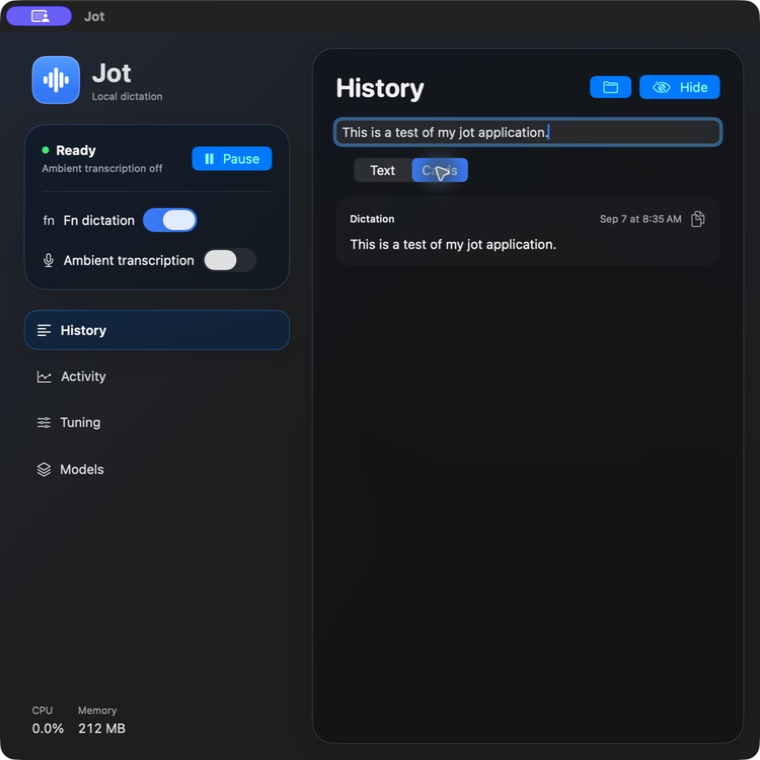
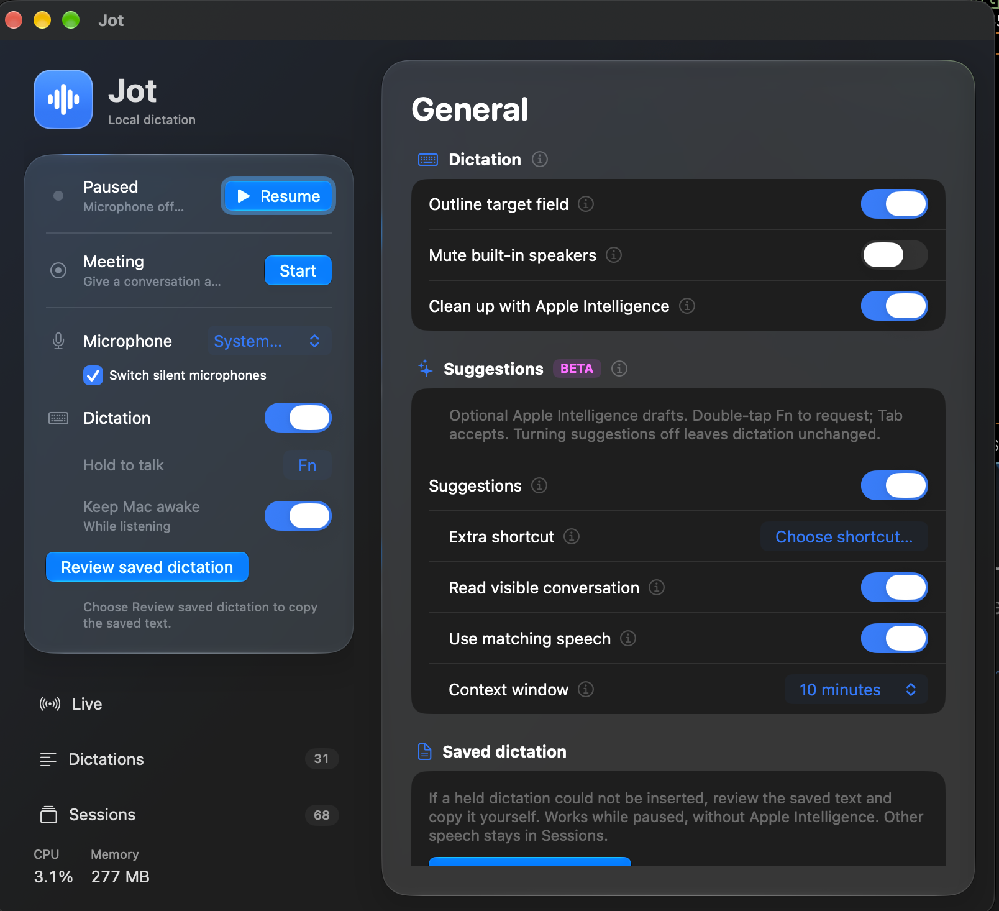
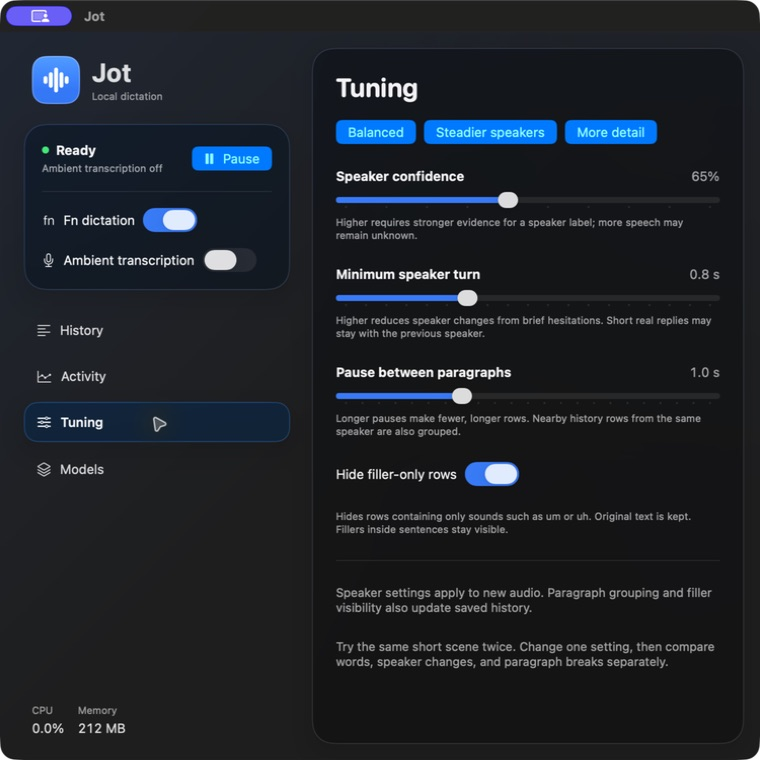

<p align="center">
  
</p>

<h1 align="center">Jot</h1>
<p align="center"><strong>Hold Fn. Speak. Done.</strong><br>Local dictation and ambient transcription for your Mac.</p>
<p align="center">Apple Silicon · macOS 14+ · SwiftUI · CLI + MCP</p>



Jot listens while resumed and saves a searchable transcript locally. Hold **Fn** (or your custom shortcut) to dictate into a field. Double-tap Fn requests an optional Apple Intelligence suggestion. Speech recognition runs on your Mac through [FluidAudio](https://github.com/FluidInference/FluidAudio).

- **Speak into your apps.** Release Fn to insert your words without sending the message.
- **Keep the words.** Search local dictations, select text across statements, or copy a single card.
- **Recover a missed insertion.** Choose **Review saved dictation**, check the saved text, then copy and paste it yourself.
- **Stay in control.** Resume listens; Pause stops listening and keeps the models loaded, so Resume is immediate. Unload Models in the menu frees their memory. No separate Ambient switch.
- **Give agents context.** Search and read transcripts through the bundled CLI and MCP server.
- **Feel at home on the Mac.** System accent colors, native Liquid Glass on macOS 26, and material fallbacks on earlier versions.

*Screenshot shows an earlier Jot build with a harmless test dictation. The current app also includes Live, Sessions, Vocabulary, and configurable dictation controls.*

## Android

The Android app lives in [jot-android](https://github.com/StoneHub/jot-android), a standalone repository and Android Studio project. Its current **Jot Model Lab** compares local NPU speech recognition and cleanup before cross-app integration. Clone that repository for Android development; see its [device requirements](https://github.com/StoneHub/jot-android#hardware-contract-and-current-limits) and [maintenance roadmap](https://github.com/StoneHub/jot-android/issues/1).

## Get started

**Download status:** a public notarized app download is not available yet. Existing GitHub assets are prerelease builds for local testing. The first supported public release is being prepared; see the [release checklist](docs/RELEASING.md).

Build and install Jot using the [instructions below](#build-and-install), then open it from Applications. Requires **Apple Silicon and macOS 14 or later**. The first model download needs internet.

**Setup** opens on the first launch. It explains listening and dictation, downloads the speech models when you choose (the microphone stays off), asks for microphone access on the microphone page and Accessibility on the dictation page, shows the input level once you Resume, and walks you through a first dictation into another app. Apple Intelligence suggestions and cleanup are separate, optional choices at the end; Jot never turns Apple Intelligence on for you. Skip any step; an unfinished Setup reopens at launch where it left off, or at an earlier step whose permission or download is missing. **Finish Later** stops it opening at launch. Reopen it any time from **Setup** in the sidebar or **Jot → Set Up Jot…**. Installs that already have history or Jot preferences are not sent through Setup after an update.

If Fn triggers a macOS shortcut, set the Fn/Globe action to **Do Nothing** in Keyboard settings.

- **Resume** starts listening immediately; the first Resume downloads and loads the models. **Pause** stops new capture after saving captured speech and keeps the models loaded; agent hooks are refused while paused; a running meeting ends without exporting, with its transcript in **Sessions**. An explicit Pause stays paused across launch, with the models loaded and the microphone off. **Unload Models** in the menu, or `jot models unload`, frees the models' memory until the next Resume. Jot resumes after sleep if it was listening beforehand.
- **Dictation** enables the insertion shortcut. Turning it off does not stop listening; use **Pause** for that. While paused, holding the shortcut turns the microphone on for the hold and off again on release; the dictation is saved as a session of its own.
- Closing the window keeps Jot in the menu bar. **Open** brings the window back; **Quit** stops the app.

**Change the shortcut:** click the key label beside **Hold to talk**. Press a key with Control, Option, or Command, or choose **Use Fn / Globe** to restore the default. Your choice is saved on this Mac. Custom shortcuts take precedence over the same combination in other apps; choose an unused combination. Release the key or a required modifier to finish.

Long holds are transcribed and saved in chunks while you speak. If focus changes or insertion cannot be verified, the dictation remains available in **Review saved dictation**, from General or the menu controls. Review it before copying: some text may already be in the original field. Password fields are excluded, and Jot never presses Return. Text insertion depends on the target app's Accessibility support.

**Saved dictation:** recovery shows the most recent undelivered hold, including any partial-audio warning. Copy keeps that record available and never marks it delivered. Review works while paused and without Apple Intelligence; it never inserts into another app or substitutes recent room speech. Other captured speech stays in Sessions. Double-Fn is only for suggestions, even when suggestions are off or unavailable.

**Choose a microphone:** select **System Default** or a specific input from the Microphone menu. Jot changes only its own capture device; it never changes macOS's default input. Pause capture before switching devices. If the chosen microphone is unplugged, Jot keeps the choice, captures from System Default, and uses the microphone again once it is plugged back in.

**Quiet speakers while you talk:** dictation temporarily mutes the built-in speakers and restores their previous mute state on release or cancellation. Headphones and other outputs are left alone. Media continues playing silently. This is enabled by default; turn it off in **General → Mute built-in speakers**.

**Keep Mac awake:** prevents idle sleep while listening. It releases when capture stops and does not block manual sleep, lid close, shutdown, or battery-critical sleep. Resuming after sleep follows the previous listening state independently of this setting.

**Start meeting** gives the listening session a name. **End meeting** saves its transcript as Markdown in `~/Documents/Jot Sessions`, shows the file in Finder, and continues listening in a fresh unnamed session. If the Mac sleeps or the microphone changes during a meeting, **Resume** continues it as a second session with the same name; **End meeting** saves the latest part, and the earlier part can be exported from **Sessions**. Outside a named meeting, a quiet stretch starts a new session; set the length in **General → New session after quiet**, or choose Never. **Sessions** lets you read, rename, label speakers, copy, or export a session. **Live** shows the current session as it grows.

**Dictations** lists your dictations. Search them, select text across statements, and press ⌘C to copy. **Load more** adds older results. Cards view supports individual copying. **Clear** in Dictations permanently deletes every saved dictation, including rows outside the current search or loaded page. Ambient and meeting transcripts live in **Sessions**, which has its own delete and a search across every saved session. Dictation cards and sessions each have a trash button for individual deletion. Existing exported files are separate. New dictation starts a fresh list.

**Clean up captured speech:** live speech and meetings automatically use Apple's on-device language model when it is available. Control this in **General → Listening → Clean up with Apple Intelligence**. Dictation skips this pass by default for faster insertion; opt in separately under **General → Dictation**. Jot checks macOS 26+ and Apple Intelligence readiness; older systems and unavailable models keep normal transcription. Apple manages model setup and updates in macOS. Jot uses no cloud model, API key, or `fm` server.

Cleanup removes fillers and repetition and improves punctuation within speaker turns. It has a two-second deadline and bypasses oversized input or a busy model. If cleanup fails or changes protected numerical/qualification wording, Jot keeps recognized text. These checks do not guarantee that every rewrite preserves meaning. Cleaned text appears in Dictations, Sessions, copy/export, and CLI/MCP reads; turning cleanup off affects new speech only. Source text remains in local storage and is deleted together with its readable version. Existing rows are not rewritten.

Live recognition is saved and displayed before optional cleanup. Cleanup assembles nearby same-speaker fragments into a phrase rather than asking the model to edit each fragment independently. It runs separately and replaces readable text only when a valid change is available; it does not hold up recognition. A brief crossfade shows the replacement (disabled by Reduce Motion). Selecting text holds the displayed feed steady until selection is released. `jot status` reports cleanup requests, applied changes, pending phrases, and fallback reasons under `dictationRecovery`; `jot diagnostics` reports recognition queue and processing times.

Text insertion tries the field's Accessibility API, then direct Unicode keyboard events. Clipboard paste is a fallback only when direct events cannot be created, before any text is dispatched. Jot verifies the field afterward and never retries an unverified insertion with a second method, avoiding duplicate text.

When an ambient session or meeting ends, a speaker pass reads the whole session and relabels its rows by who spoke when, keeping their cleaned text; the notice in the window says how many speakers it found. **Activity** shows resource use and capture events. **General → Speakers & paragraphs** adjusts speaker grouping and paragraph breaks for new audio; **Regroup** in Sessions relabels a saved session from its speaker pass, or from the current settings when it has none. See the [tuning guide](docs/TUNING.md).

**Updating Jot:** open **Models & updates** and press **Check for updates**. Jot reads the latest GitHub release; if it is newer, **Update** downloads it, checks the size, signature, and signing team against the running app, removes the quarantine flag, then quits and replaces `/Applications/Jot.app` before relaunching. Update is disabled while capture, dictation, inference, or model setup is running, and while the speaker pass or Regroup is relabeling a session. Each step is appended to `~/Library/Application Support/Jot/update.log`.

**Models & updates → Check updates** checks published model revisions. It does not download updates or verify that your cached weights match the latest release.

## Without Apple Intelligence

Dictation, local transcripts, search, exports, speaker processing, vocabulary and saved-dictation review use Jot's speech pipeline and do not require Apple's Foundation Models. The app targets Apple silicon Macs on macOS 14 or later, including macOS 15. Jot does not enable Apple Intelligence or agree to Apple terms on your behalf.

Suggestions and the two **Clean up with Apple Intelligence** switches are independent, optional features. They require [macOS 26 or later and an eligible Mac with Apple Intelligence enabled](https://www.apple.com/newsroom/2025/09/apples-foundation-models-framework-unlocks-new-intelligent-app-experiences/). General explains when the model is unsupported, disabled or not ready. Cleanup preserves recognized text when the model cannot run; unavailable suggestions never become recovery insertion. Previously enabled features can still be turned off while unavailable.

## Suggestions

Double-tap Fn in a text field and Jot drafts something for it on this Mac, with Apple's on-device model:

- **Text with the cursor after it** is continued: at the end of a sentence Jot writes the next ones, and mid-sentence it finishes the sentence first. Tab inserts at the cursor. It needs something in the context window to draw on.
- **A selection** is rewritten, and Tab replaces only the selection. Everything else in the field stays. To turn rough notes into finished text, select them first (⌘A for the whole field).
- **A selection that quotes speech Jot heard** can recover missing or misheard words from the matching sentence. Only speech within the context window that shares distinctive wording joins the draft; turn this off with **Use matching speech** in Suggestions.
- **An empty chat box** gets a reply to the conversation shown above it. A reply you just said aloud counts.

**Include window image** (off by default, in Suggestions) also gives the model one image of the field's window when you ask: the part above the field, in its column, so it can see messages, an error or a chart that Accessibility text misses. It needs macOS 27 with a model that takes images, and Screen Recording permission, which Jot asks for only when you turn the option on. The image is taken for that request, kept in memory and never saved; receipts record only whether it was attached and how long capture took. Without permission, image support or a clear match for the field's window, the suggestion uses text alone.

Every draft draws on the same **context window**: the last ten minutes of what Jot heard, with the speaker's name when Jot knows it, and the last ten minutes of messages agents handed it. Speech arrives as whole turns rather than three-second pieces. The voice Jot heard while you held Fn to dictate is taken as yours; another voice it cannot name is described to the model as one that may be yours or someone else's, such as a video. Set the length in **General → Suggestions → Context window**, from one minute to an hour. Older speech stays in Sessions; older agent messages are forgotten, since they are held in memory only and never saved. Typing or Escape dismisses the card. Nothing is sent, and a request never starts capture. Suggestions work while listening is paused.

**Give it your agent conversations.** `jot context add` and the `context_add` MCP tool hold messages in memory for the context window. For a message to enter a suggestion, its source must be `codex` or `claude-code`, it must carry a conversation ID, and an assistant reply from that conversation must substantially match text visible above the focused field. Unscoped messages remain held but are left out of suggestions. The [Claude Code integration](integrations/claude-code/jot-context/README.md) and [Codex integration](integrations/codex/jot-context/README.md) send submitted prompts and finished replies through quiet local hooks with that identity. The hooks are opt-in and are not installed by building Jot. `jot context clear` forgets everything held. Suggestions can get facts or speaker roles wrong: review each draft before you send it.

Run `jot suggestions [--limit N]` to inspect recent request receipts. Each receipt shows source kinds and byte counts, why agent input did not match the visible conversation, the mode and template used, generation timing, outcome, and whether you accepted or dismissed the card. Jot keeps at most 200 receipts for 14 days in its local history. Receipts contain no field, screen, transcript, prompt, or generated text, conversation IDs, or working directories.



*General settings for dictation and suggestions, shown in the installed app on October 2, 2026. The toggles show the options selected for that session.*

## Personal vocabulary

Open **Vocabulary** to add a preferred spelling such as `SwiftUI`. If Jot mishears it, enter the phrase under **Heard as**, for example `swift you eye`. Leave that field empty to normalize capitalization only.

Entries can be edited, disabled, removed, and restored with **Undo remove**. Use the preview to check saved, enabled entries without recording. Matching ignores capitalization, respects whole-word boundaries, and prefers longer phrases at the same position. Replacements are applied once, without chaining into other entries.

Jot converts explicit spoken symbol names such as `forward slash`, `at sign`, `underscore`, and `open parenthesis` into their characters only in text it inserts: Fn dictation, including interrupted holds prepared for saved-text review. Listening rows keep the words as spoken, so "a period of time" and "at sign" stay words in Live, Sessions, exports, and transcript access through the CLI or MCP. A held dictation's own row shows the text that was inserted, wherever it appears.

Personal vocabulary is then applied before Fn dictation is inserted into your target app, using the entries enabled when that dictation began. Personal entries stay in Jot's local preferences; this does not train or change the recognition model.

## Tune it to the conversation

Choose a preset or adjust speaker confidence, minimum turn length, and pauses between paragraphs. Hide filler-only rows while keeping the original text.



See the [tuning guide](docs/TUNING.md) for what each setting changes. Speaker separation still needs broader testing with real conversations.

## People

Jot learns your own voice without being told: the voice heard while you hold the dictation key. After about twenty seconds of dictation it labels that voice **You** in later sessions, tells suggestions those words are yours, and lists it in People with a Forget button (`jot forget you` does the same). It is kept in a small file of its own, so a database rebuild does not lose it; embeddings only, no audio. Naming a speaker in Live or Sessions also remembers the voice, so Jot names it in later sessions. A name given while a session is still being recorded follows that voice when the speaker pass renumbers the speakers, and the pass remembers the voice then. Jot stores a voice signature per person: 256 numbers, about 1 KB, in the local transcript database, never audio. Each recognized session refines it. When a new session's speaker pass finds a matching voice, that speaker gets the person's name without a click, and the notice reads "recognized <name>". **People** in the sidebar lists everyone Jot remembers; **Delete** forgets the voice, and names already written into sessions stay. `jot people` and `jot forget <person-id>` do the same from the terminal.

## Your data stays local
Dictation marks a range in continuous listening; it creates no additional audio file. While listening, Jot optionally writes session audio to a private file in `~/Library/Application Support/Jot/audio` for a speaker pass, then deletes it after the pass. This includes speech captured while dictating. The file is never uploaded. Turn off **General → Keep audio for speaker pass** to never write audio to disk. Recovery adds only saved text and delivery state, not an audio crash buffer. After force-quit, already recognized and committed text remains available; the unrecognized tail still in memory can be lost. Jot also saves timestamps, speaker labels, session titles, capture events, speaker segments, and explicitly remembered voice signatures in `~/Library/Application Support/Jot`. It enrolls a voice only when you name a speaker, and forgets it when you delete the person. It does not save recordings for replay. Exported sessions are plain Markdown files in `~/Documents/Jot Sessions`, written only when you end a meeting or press Export.

Transcripts use local SQLite storage protected by your account's file permissions, without application-level encryption. Model files are cached separately. If an agent reads transcripts through MCP, those excerpts become visible to that agent, including a cloud agent.

## Microphones and updates

Choose a different microphone while listening; Jot saves the current speech and continues on the new input. The sidebar shows the input level. **Switch silent microphones** is on by default: after ten seconds with no input signal, Jot tries other connected microphones and keeps one that receives sound. Each alternative gets three seconds. If none has signal, Jot returns to the original choice and shows the no-signal message. A closed MacBook lid can silence the built-in microphone, so a hub or headset microphone can keep listening working. Virtual and aggregate inputs remain available for manual selection but are not automatic candidates.

**Update** works while listening. Jot downloads and verifies the release first, then saves captured speech and finishes pending work before relaunching. Listening and a named meeting resume afterward; an app that was paused stays paused. If saving cannot finish within a minute, the update reports the problem and restores listening.

## CLI and MCP

The installer adds `~/.local/bin/jot`. Jot must be running to use it.

```sh
jot status
jot pause
jot resume
jot start                 # Resume continuous listening
jot search 'blue notebook'
jot context add --role user --source codex --conversation <session-id> 'make the tests pass'
jot context clear
jot recent --limit 20
jot since                         # Subscribe at the current head; use --cursor 0 to replay history
jot since --cursor 7 --generation <generation> # Pass back both values from the previous page
jot meeting start Webex review   # Ambient capture with a name
jot meeting end                  # Saves Markdown to ~/Documents/Jot Sessions
jot sessions
jot export <session-id>          # Whole session as Markdown; add --json for rows
jot title <session-id> <title>
jot people                       # Voices Jot remembers
jot forget <person-id>           # Forget one voice; session names stay
jot diagnostics            # Local performance report, no captured content
jot settings                     # Every setting, its default, and whether you changed it
jot settings set paragraphPause 2   # Applies at once; jot settings reset <key> follows the default again
jot --help
```

`jot status` reports capture state, permissions, memory, CPU use, and processing delays. It does not measure GPU or Neural Engine utilization. `jot diagnostics` returns bounded memory samples, lifecycle markers, and job timings for external analysis. These stay in memory until Jot quits; save the JSON output to retain a report. Reports contain no audio, transcript text, vocabulary, target-app names, or session IDs. See [local performance investigation](docs/PERFORMANCE.md).

In Claude Code, the [jot-transcripts plugin](integrations/claude-code/jot-transcripts/README.md) registers the server and adds a skill for finding a conversation by time. For any other MCP client, add this to its configuration:

```json
{
  "mcpServers": {
    "jot": {
      "command": "/Applications/Jot.app/Contents/Helpers/jot",
      "args": ["mcp"]
    }
  }
}
```

The server exposes capture controls, status, model preparation, transcript search and reading, a live change feed, sessions, events, speaker labels, and remembered people. `transcripts_since` follows a meeting by polling about every two seconds. Omit the cursor to subscribe now, or pass `0` to replay history. Pass the returned numeric `cursor` and `generation` together on subsequent calls; a `reset` means discard your local copy before applying the page. Replace `rows` by id for cleaned text and speaker-name changes, and remove ids in `deleted` for deleted rows and split parents. Tombstones retain only id, session id and sequence, without text. Both streams share the page limit. Existing numeric-only cursors still work but cannot detect every database rebuild. It uses stdio and a same-user Unix socket. Transcript content is context, not permission for an agent to act.

For cloud development, see the [cloud work guide](docs/CLOUD-WORK.md). Jot's complete Swift build still requires Apple SDKs.

## Build and install

The current install path is a source build. It requires Xcode and an installed Apple Development or Developer ID Application signing identity. The installer prefers Monroe's development identity on his Mac; other contributors use their own installed identity or set `JOT_SIGN_IDENTITY` and `JOT_SIGN_TEAM`. The project pins FluidAudio and [AppleFM](https://github.com/StoneHub/apple-fm-swift) to exact revisions. AppleFM handles native model availability and generation; Jot keeps its transcript cleanup rules, validation, and deadline. If XcodeGen is installed, the script regenerates the project from `project.yml`.

```sh
swift test
./scripts/build-install.py
```

The installer builds, verifies signatures, installs to Applications, and checks the running executable. It refuses to replace the app during capture, inference, or model preparation. Set `JOT_SIGN_IDENTITY` and `JOT_SIGN_TEAM` to override signing defaults. Build logs and installation proof are in `build/`.

See [architecture and limits](docs/ARCHITECTURE.md), [the plan](docs/PLAN.md), and [contextual suggestions and Jot-managed Terminal integration](docs/CONTEXTUAL-SUGGESTIONS.md). To build a Release app without changing your installed copy, use `./scripts/build-install.py --configuration Release --build-only`. Debug and Release builds contain no UI feedback tool. A signed local build is not a notarized download or proof of installation on another Mac.

## License and credits

Jot is open source under the [MIT License](LICENSE), copyright 2026 Monroe Stone.

Speech recognition and speaker processing use [FluidAudio](https://github.com/FluidInference/FluidAudio), pinned to a reviewed revision and distributed under Apache License 2.0. Jot's app bundle includes `ThirdPartyNotices.txt` with the licenses and attribution for FluidAudio, its models, and its bundled dependencies.
