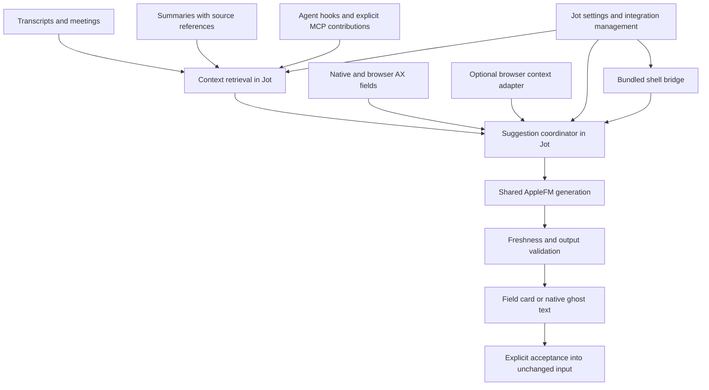

# Contextual suggestions in Jot

Status: product direction agreed September 25, 2026; implementation plan, not a shipped feature. This document supersedes the earlier research-only suggestion of a Codex-only, field-only experiment. It authorizes no capture, shell configuration or integration changes by itself.

## Outcome

Jot should help write the next useful thing wherever the user is typing. It should connect relevant speech, meetings, summaries and agent conversations to the current input field, including a blank field. Codex is the first and primary use case. Compatible native fields and browser fields belong to the same design; app names do not impose an artificial boundary.

Move the existing Terminal completion into Jot's product ownership. Jot owns local inference, context, settings, installation and updates. A small shell bridge remains responsible for the real shell buffer, native ghost text and acceptance. The user should manage this in Jot rather than maintain a separate Terminal application or remember shell installation commands.

Shared context is a central requirement, not an optional enhancement after ordinary autocomplete. For example, a recent discussion about checking a project's tests could help suggest a test command in that project's blank shell prompt, or a question about the test failure in Codex. The source must actually identify the command or supply enough evidence; Jot should not invent it from a vaguely related meeting.

## Agreed behavior

- Use one shared engine with distinct modes for a user's next reply, text continuation and shell-command completion. Each mode has its own examples and validation.
- Offer automatic suggestions after focus settles or typing pauses, including on empty inputs when relevant context exists. Keep an explicit request shortcut for repeatable testing and manual use. Start automatic behavior as an opt-in experiment, without redefining the product as manual-only.
- Use inline ghost text when the integration can place it correctly. Otherwise show a nonactivating card anchored to the field. Keep the target focused.
- Acceptance inserts into the unchanged field or shell buffer. Sending a message and executing a command remain separate user actions. A grounded “Yes, fix X” is a valid draft; the suggestion itself is not authorization to perform the fix.
- Keep ordinary Tab behavior when no valid suggestion is being accepted. Native/browser integrations need collision and composition checks before consuming Tab; the shell bridge can use the existing ZLE acceptance behavior.
- Let the user see why a suggestion appeared, with concise source attribution such as “Recent discussion + current project,” and inspect or exclude the sources.

## Existing foundation and evidence

The initial source baseline is Jot `7a56879`. This is a code/evidence inventory, not a claim that the new feature exists.

| Existing component | Reuse | Missing work |
| --- | --- | --- |
| [DictationInput](../Sources/Jot/DictationInput.swift) | Focused AX field, secure-field exclusion, focus generation, insertion and readback | Draft/selection revisions, conversation identity, suggestion lifetime; require exact text readback for the first acceptance proof |
| [DictationHighlight](../Sources/Jot/DictationHighlight.swift) | Nonactivating panel and field geometry | Suggestion text, source affordance, dismissal and acceptance |
| [TranscriptStore](../Sources/JotCore/TranscriptStore.swift) | Local transcript rows, sessions, speaker labels, times, cleaned text and search | Bounded retrieval by relevance and context scope; invalidation on edits/deletion; no full-library scan per focus event |
| [LocalService](../Sources/JotCore/LocalService.swift), [SpeechServiceIPC](../Sources/Jot/SpeechServiceIPC.swift) | Bundled helper and same-user Unix socket | Suggestion and context-ingest contracts with short deadlines and client capabilities |
| [MCPTools](../Sources/JotCore/MCPTools.swift), [JotCLI](../Sources/JotCLI/JotCLI.swift) | Agents can request Jot context and controls | Explicit inbound context contribution; MCP is not an automatic feed of client conversations |
| AppleFM dependency | On-device availability and fresh text/structured generation | Jot-owned prompts, scheduling, retrieval and acceptance policy |
| [apple-fm-terminal](https://github.com/StoneHub/apple-fm-terminal) | ZLE buffer/cursor/directory tracking, `POSTDISPLAY`, Tab/Escape, stale-result checks | Bundle and manage the bridge from Jot; replace its direct model call; add contextual empty-buffer support |

Meeting capture and transcript export exist. Generated meeting notes are planned in [the roadmap](PLAN.md); `sessionSummary` currently returns session metadata, not a semantic meeting summary. The suggestion system must accept versioned summaries when available, without making them a prerequisite for transcript-based context or pretending they already exist.

Read-only native AX research on September 24 found Codex's ordinary `AXTextArea`, readable value/selection and a usable field rectangle. The selected-range bounds call returned a zero-sized rectangle. Nearby text was readable, but author attribution, clipping and conversation boundaries were not proven. The field was not focused at the final sample; Jot insertion into it was not exercised. CUA/agent tool access is separate from Jot's permission and runtime behavior.

Five synthetic generic-helper cases exposed context echoing, wrong-speaker output, an invented tabs preference, and a quoted-instruction echo; only the empty-input preflight abstained correctly. A reply-specific contrast produced “Can you clarify whether you want to see the explanation or the proposed guard diff?” despite the user already asking for an explanation, and repeated the formatting-choice question back to the assistant. Both generated replies failed the useful-next-reply criterion. An empty-context case abstained before inference. These tiny checks establish a quality risk, not a quality or latency benchmark. Browser insertion and a Jot-managed shell bridge remain untested.

## Architecture

Keep these boundaries small and concrete. The suggestion coordinator owns request lifetime, mode, deadlines, arbitration and result validation. Context retrieval owns source selection, provenance and invalidation. An integration owns target identity, input snapshot, display and acceptance. AppleFM stays generic; it does not learn about AX, transcripts or shell widgets. Do not create a general plugin framework before actual integrations need it.

Use Jot's local service for the shell bridge and inbound contributions; internal callers can use the same underlying context/suggestion operations without routing through MCP. Keep slow AX calls, retrieval and generation off the capture/UI path. The existing same-user check is a transport boundary, not a claim that every same-user client should receive every transcript or invoke every capture control. Give enrolled integrations only their needed operations; validate source identity and bounded payloads at ingress.

Suggestion lifecycle is independent of microphone capture. Listening may be paused while the user still wants typing assistance and access to retained context. Requests must not resume recording or load speech models. Quitting Jot disconnects integrations gracefully; the shell must remain usable. Do not add a separate model daemon or persistent background service merely to keep suggestions alive.

## Context: available broadly, retrieved selectively

Make the user's selected Jot context sources available to the engine. Retrieve a small relevant set for each target instead of placing everything recently said into every prompt. A meeting participant's statement is evidence of what that person said, not automatically the user's preference, promise or instruction.

| Source | Useful association | Proposed acquisition |
| --- | --- | --- |
| Current draft/selection | Exact field and input revision | Generic AX or integration snapshot |
| Recent dictation | Source utterance, time and originating target | Existing dictation transaction plus source references |
| Ambient/meeting transcripts | Session, time, speaker, topic and user-selected work context | Bounded local retrieval over retained Jot rows |
| Meeting/session summaries | Source IDs/revisions and author/model provenance | Existing or future summary producer; regenerate/invalidate when sources change |
| Typed agent prompts | Conversation/turn, project and user role | Supported prompt-submission hook; explicit MCP contribution; browser/native adapter where supported |
| Assistant responses | Same conversation, assistant role and completed revision | Supported completion hook or attributable visible text; label model output distinctly |
| Explicit selections/pinned context | User-designated source and destination scope | “Use as context” and a selectable active context in Jot |
| Shell state | Shell session, buffer/cursor revision and current directory | ZLE bridge; no inference from arbitrary scrollback |

A context item needs an ID, source kind, origin application/integration, conversation/session/turn where known, timestamp, speaker/author role, project/task association where known, text revision and retention/scope. Derived summaries retain source references. Unknown identities stay unknown. Deduplicate when the same words arrive through dictation and a submitted prompt. Distinguish a shown suggestion, an accepted draft and a submitted user message so a generated guess is not recycled as established user intent.

Start retrieval with the target's explicit context selection and task/conversation/project association, then relevant recent evidence. Recency alone is insufficient. Cross-app reuse is intentional: the same work context can connect a spoken conversation, agent prompt and shell session. Cross-project or personal/work mixing requires a matching association or user-selected source. Respect excluded apps/sites/workspaces before content ingestion, and never perform background repository discovery to infer context.

For a blank field, use the active task/context and recent associated intent as the retrieval query. If the connection is ambiguous, show nothing or offer a context choice through the explicit request path. Lack of typed characters is not itself a reason to abstain. Focus on a search box, URL field, password field or unknown custom widget does not establish that it wants a conversational reply. The integration must establish the field's purpose; generic text continuation can work more broadly than whole-reply generation.

Proposed first experiment bounds: at most six excerpts and 4 KiB total source text, up to 128 generated tokens and one short paragraph. Treat these as tunable parameters, not permanent architecture limits. Prefer intact evidence over truncating away negation or prerequisites. Use a fresh session, a two-second deadline and one latest active request. Cancel stale work and suppress repeat suggestions after dismissal until the input/context changes. Measure cold/warm latency and capture impact before settling defaults.

Do not copy the entire transcript library into a second store. Reference existing retained transcripts; keep imported agent context in a bounded local store with source controls. Proposed initial imported-context retention is 24 hours unless the user pins it; clear or unpin in Jot. Source deletion/exclusion invalidates derived summaries, retrieval indexes and pending suggestions. No prompt or output text in operational logs. Keep new suggestion inference on device. Giving context to a cloud agent through MCP is a separate user-enabled data flow, not a side effect of local suggestions.

## Hooks, MCP and browser access

There are two directions: agents reading context from Jot, and integrations contributing context to Jot. Keep them distinct in the API and settings. The current MCP catalog implements the former; no inbound prompt collector exists.

Official [Codex hooks documentation](https://learn.chatgpt.com/docs/hooks), checked September 25, documents `UserPromptSubmit` with a prompt and turn ID, alongside common session ID and working-directory fields. This is a promising precise ingress point for submitted intent. Verify firing, payload and identity on the installed desktop version before depending on it. Capture a bounded event through the bundled helper, return promptly, and never block or alter prompt submission. Do not emit captured text on hook stdout, where hook output can affect the agent. Do not parse private conversation databases or rely on unstable transcript-file formats. Completion-event coverage needs its own check.

An explicit context-contribution MCP tool can send a bounded excerpt with provenance when the client supports it. It is not guaranteed to run every turn. As the [MCP tool-call model](https://developers.openai.com/plugins/concepts/mcp-server) describes, the client invokes a server tool with arguments; simply connecting Jot does not give it all typed messages or hidden conversation state. ChatGPT desktop/browser capture is a separate capability check, not inherited from Codex's hooks. Do not expose Jot's socket on the network or add a remote tunnel as an implicit solution.

Start browser support through generic native AX. Add one browser extension if DOM access materially improves field identity, selection, conversation attribution or rendering. Use site rules within that integration where needed; do not require a separate plugin for every site. Source capture and output insertion can have different integrations. Exclude private browsing by default and support per-site/source controls. A browser extension's installation/update rules differ from a bundled shell file; Jot should present setup and health honestly rather than claim it can silently manage browser-store updates.

## Request and acceptance contract

Proposed contracts, not existing socket methods:

- **Target snapshot:** integration/client ID, PID/window/field or shell session identity, input revision, before/after text, selection, conversation/context scope, purpose/mode and capabilities for display/acceptance. Use opaque IDs for identity rather than raw transcript text in telemetry.
- **Suggestion request:** unique request/generation ID, snapshot, trigger, deadline and context scope. The service chooses allowed sources and returns their references; the client does not grant itself more context access by claiming a scope.
- **Suggestion result:** `suggestion` or `abstain`, insert text/replacement range, required input revision, source references, expiry and reason. A typed `userDraft` schema can help evaluate role confusion; schema validity alone does not prove usefulness.
- **Context contribution:** enrolled source, event identity, role, conversation/project association, time, revision, bounded text and retention. Deduplicate retries and distinguish imported claims from verified native metadata.
- **Acceptance:** integration revalidates identity, input, selection and source freshness, then inserts once. Report accepted/verified, uncertain or cancelled without retrying ambiguous delivery. Never generate Return, click Send, invoke a shell command or call an agent action.

Changing focus, draft, selection, task, working directory or relevant source content cancels the preview. Notifications alone are insufficient; reread the target at acceptance. IME composition, completion-menu collisions and unsupported geometry require fallback or abstention. Secure fields fail closed. Context text is data, including quoted instructions. Unknown preferences stay unknown. Suggestions that grant permission must reflect the user's stated intent and still await the user's acceptance and sending.

## Terminal ownership and migration

The current standalone zsh integration already has the accurate `LBUFFER`/`RBUFFER`/cursor/directory state and native `POSTDISPLAY` behavior that AX screen scraping cannot replace. Retain that small bridge and move its inference request into Jot. Keep mode distinct for shell commands versus a conversational TUI running inside Terminal; the shell bridge must not pretend it owns another program's input.

Jot's integration screen should show:

- Terminal setup state: not set up, ready, disabled, Jot unavailable, update pending for existing shells, or conflict needing repair.
- Enable/disable, test suggestion, repair and remove actions, the detected shell configuration location, installed/active bridge versions and conflicting bindings.
- Which context sources apply, automatic versus manual suggestions, and the acceptance shortcut.

Ship the bridge and helper in Jot's signed app bundle and version their protocol together. Prefer a small stable loader managed by Jot that resolves the current bundled bridge; it must fail quietly if the app moves or disappears. Determine the supported app location during implementation. New shells load the current version; existing shells report their active version and offer an explicit reload/restart path. On mismatch or an unavailable service, restore normal completion instead of hanging or launching another model process. Use a short asynchronous request path; do not reuse the current CLI's long general-purpose timeout for interactive keystrokes.

Migration must inspect the existing standalone install and the user's actual `ZDOTDIR`/configuration before editing. Preview the exact managed-block change in Jot, back up affected files, and replace only a recognized complete block. Preserve unrelated settings and shell widgets. Disable the old integration for new shells without running both Tab handlers; retain a rollback path until the new bridge passes its smoke. Do not delete old files or kill/reconfigure existing shell sessions merely because Jot now owns the feature. Remove should undo only Jot-owned setup and restore captured bindings when still owned by Jot.

Keep the existing command-output validation and add contextual empty-buffer coverage deliberately. Suggestions never execute. Verify the transfer before retiring the standalone installer/updater; do not strand users of that repository. The final managed experience must not require editing `.zshrc` or running a separate updater by hand.

## Delivery sequence

Each step should leave inspectable evidence. These are implementation tasks to follow this documentation, not claims of completion.

| Step | Deliverable | Exit evidence |
| --- | --- | --- |
| 1. Context and quality experiment | Synthetic cross-app scenarios; bounded retrieval from source-tagged fixtures; role examples or structured draft output | Correct USER voice, relevant source selection, appropriate abstention, no invented preferences; publish actual outputs including failures |
| 2. Codex vertical slice | Shared coordinator and local generation; current-field and relevant Jot context; explicit request plus opt-in focus-triggered empty-field preview | From actual Jot: context-backed suggestion, accepted exact insertion, no send; focus/draft/source changes cancel; listening remains unaffected |
| 3. Jot-managed Terminal | Bundled bridge, local IPC, setup/status/repair/remove UX and standalone migration | PTY tests plus actual Terminal shell: new/old shell versions, conflict/rollback, app unavailable, blank-buffer context, Tab acceptance without execution |
| 4. Browser and broader fields | Validate generic AX; add one browser integration only where needed | A browser chat composer and ordinary native text field use the shared engine; unknown purpose/unsupported fields fail predictably |
| 5. Submitted conversation context | Verified Codex hook and explicit MCP contribution; browser/ChatGPT ingress where supported | User prompt becomes attributed context for another surface; revocation/deletion and duplicate events work; capture never blocks sending |
| 6. Dogfood and tune | Default timing, context selection and automatic suggestions tuned against observed use | User judges useful suggestions in Codex and Terminal, can manage all integrations from Jot, and sees no capture regression |

Steps 1–2 use existing Jot speech context and do not wait for hooks or meeting-note generation. Hook capability checks can inform the contract early. Keep capability-based cross-app support throughout; Codex-first is test priority, not a permanent allowlist.

## Acceptance scenarios and measures

| Scenario | Expected behavior |
| --- | --- |
| Recent meeting specifies a test command for project A; blank prompt in A | Offer that grounded command with source attribution; Tab inserts, Enter remains separate |
| Same meeting; shell moves to unrelated project B | Suppress the old suggestion; no cross-project leakage from recency alone |
| User asks an agent to explain a failure before fixing it; later focuses Codex | Draft a useful explanation request in the user's voice, not a question asking the assistant to guess the user's intent |
| User has stated they want a particular fix | A matching “Yes, fix X” draft is permitted; showing it performs no action |
| Blank browser reply field plus relevant selected/pinned meeting context | Offer a grounded draft without requiring the user to type a prefix |
| Unknown preference, conflicting speakers or stale/deleted summary | Clarify or abstain; preserve provenance and prefer current source evidence |
| Draft edited, same-length edit, focus/task switch, IME or late model result | No stale insertion and no stolen navigation/composition key |
| Quoted malicious instruction in a transcript or assistant response | Treat it as source text; no action, prompt-role takeover or secret collection |
| User accepts and sends a suggestion; a hook records it | Preserve generated-to-accepted-to-submitted provenance; avoid reinforcement loops |
| Jot quits, updates, microphone pauses, or the bridge is disabled | Shell and normal typing remain usable; no surprise recording or duplicate Tab handler |
| Source or integration removed | Pending suggestions and derived context are invalidated; managed setup can be undone |

Evaluate retrieval and generation separately. Record groundedness, wrong-speaker replies, invented details, useful suggestions versus abstention, acceptance/edit/dismiss rates, stale insertions, key collisions, and warm/cold median/p95 time to preview. Count exact insertion and no-send/no-execution separately from model quality. Use synthetic fixtures first; real-content evaluation stays local and user-scoped. Do not treat a small successful fixture set or a schema-valid response as a product-quality claim.

Protect the existing roadmap's capture guarantees: zero new audio gaps and no new main-thread stalls over its 50 ms target. Compare suggestion-on/off under the same workload. Suggestions yield to speech work; overload cancels rather than accumulating a queue. No new UI performance/debug overlay is needed.

## Next decision

The immediate next implementation task is the context-and-quality experiment with a small Codex proof, followed by managed Terminal delivery. Set the evaluation rubric before tuning prompts. Resolve hook support, target association and active-shell upgrade behavior with focused prototypes. Do not require a universal context harvester or flawless caret geometry before testing the useful shared engine.
