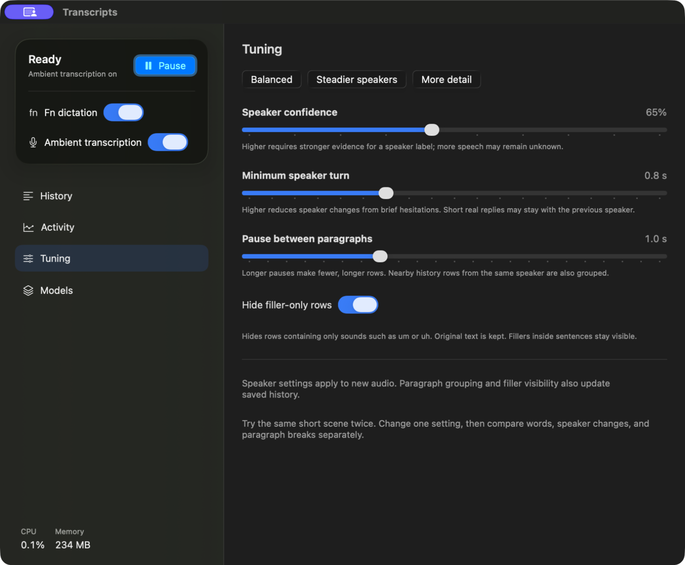
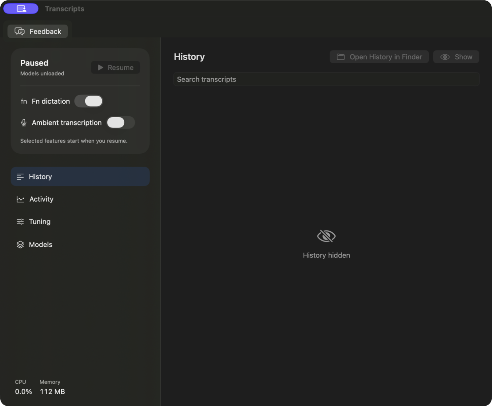
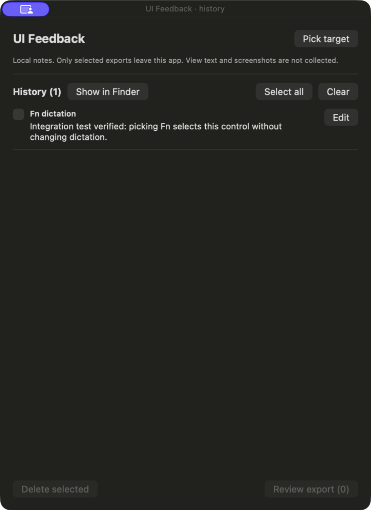

# Verification record

Initial implementation, 2026-09-06 on an Apple M5 Pro / 64 GB Mac running macOS 26.5.2, Xcode 26.6.

- `swift test`: 11 storage and Unix-transport tests passed. Covers persistence, search escaping, session labels, time ordering, journal pagination/validation, duplicate-service ownership, request bounds, and client/server round trips.
- Signed native Xcode build succeeded. Installer resolves its current product via `-showBuildSettings`, verifies the source and installed signatures, compares executable SHA-256, and confirms the installed process path. Machine-specific proof stays in ignored `build/install-proof.json`.
- Bundled CLI and MCP: initialize, 12-tool enumeration, live status, and capture-event reads passed; MCP stdout contained protocol frames only.
- FluidAudio models downloaded and loaded. A generated, approximately 8-second speech sample went through recognition and Sortformer in 0.40 seconds on the installed initial build. All intended words were returned, with Speaker 1. This is a functional smoke check, not a representative accuracy or sustained-performance benchmark. The diagnostic retained no transcript rows.
- Fn delivery: the initial attempt captured/transcribed but the user saw no insertion. After adding readback and fallback, the user confirmed it works. Installed status independently reported verified AX insertion into a Microsoft Edge text field; the 3.79-second utterance took 0.16 seconds for recognition. The final build additionally tags its own paste events so they cannot be mistaken for a physical Fn chord.

- Ambient microphone test: played the generated sample through the Mac speakers, captured 9.18 seconds, persisted one Speaker 1 segment containing the expected phrase, and paused successfully. Start/pause events persisted and no audio was dropped. Inference took 0.40 seconds. The first status poll was premature; status now computes pending queue duration directly, and pause starts the final queued inference immediately.

No previous application existed for a before screenshot. After-build screenshots use the native history-hidden state to keep actual microphone content out of this repository. No audio or personal transcripts are committed.

Still requires broader live use: Fn insertion in additional target apps (including Codex), speaker separation across real people, longer ambient use, and sleep/input-device recovery. The selected FluidAudio stack remains the implementation; these checks do not initiate a model comparison.

## Native UX revision

- Sixteen core tests pass, including generation-based pause cancellation, load failure/retry, and honest model-revision reporting.
- User confirmed that Pause reaches “Paused / Models unloaded” and menu-bar Open reuses one window.
- Installed lifecycle check: Resume immediately followed by Pause stayed paused; a subsequent Resume loaded models and completed the existing file diagnostic in 0.35 seconds, without playing audio. Final Pause reported models unloaded, Fn listener off, microphone off, and empty queues.
- Clicked the earlier test dictation in the native UI. The row showed Copied; pasting into the search field produced the exact same text, verifying clipboard contents without publishing actual ambient speech.
- The app's regular activation policy was checked while its single window was open. A single SwiftUI Window scene and disabled automatic tabbing replace the prior WindowGroup. Closing the window changes the app to accessory mode; menu-bar Open restores regular mode.
- Installed MCP exposes 15 tools; initialization, enumeration, and paused-service status passed. Model publication checks succeeded for all three upstream repositories. These checks do not establish the revision of previously downloaded cache files.
- The macOS 26 build uses native Liquid Glass surfaces/buttons. Earlier supported macOS versions use native material/button fallbacks. Model references are released on Pause; process/framework caches can remain resident, and actual Neural Engine utilization is not measured.

Before: the initial status window above. After: one native app containing controls, history, activity, and models. This screenshot is filtered to the earlier test phrase only.

## Human tuning follow-up

Twenty core tests pass. New cases cover a short filler with a spurious speaker score staying within one turn, sustained genuine speaker changes still splitting, adjustable confidence/paragraph pauses, and history filtering preserving source text. The installed Tuning page exposes presets and three bounded sliders plus filler-only row visibility. All inference inputs use a per-job settings snapshot; the current settings are returned by status. Film/reference alignment remains a manual short-scene check, described in TUNING.md.

Installed UI verification: clicking Steadier speakers changed the controls and CLI status to confidence 0.75, minimum turn 1.2 seconds, and paragraph pause 1.5 seconds. Incrementing the minimum-turn slider changed both UI and live status to 1.3 seconds. Balanced was restored afterward. The user's active ambient session was preserved; no playback or service restart was used for this check. The signed installed executable matches the checked build, with SHA-256 `e49d3fe2a94e30bc5099c4f36c2ba76a975e9531714657827488faa4b26ec2a1`.

## SwiftUI feedback and Finder access

- Branch `codex/swiftui-feedback` builds on the pushed speech implementation without changing the speech pipeline. DevFeedback is vendored unchanged from upstream commit `9ad898738b4e303c4001acc61db6de1e44112c0b` (package code finalized at `d2e0070`).
- All 20 speech tests and 5 feedback persistence/export tests pass. The complete Debug host is signed and installed. The complete Release host builds; the feedback package also builds in Release with no-op view modifiers.
- Current Xcode product: `build/DerivedData/Build/Products/Debug/Porch Speech.app`. The installer resolved this path from the current build settings, checked source and installed signatures, and verified matching executable SHA-256 `37217ab25aa659cf30c46ebdf1b70610f71a86484af8160e5b3ea3a7eaf1c7c9`. Installed process PID 83776 ran `/Applications/Porch Speech.app/Contents/MacOS/Porch Speech` at verification.
- After explicit user approval to replace the active app, capture was paused before installation. The installed app remains paused with Fn selected, ambient off, and models unloaded.
- A physical click on Fn in pick mode opened `service.fn` feedback without toggling Fn or starting capture. Switching from History to Tuning before capture produced `screen: tuning` and the correct source call site. Save & pick next, history edit/save, selected Markdown preview, and native JSON export all worked. The saved test note survived the final app replacement and remained available on a different screen.
- History → Open History in Finder selected the exact transcript SQLite file. Feedback → Show in Finder selected its app-scoped `history.json`. No history was deleted. A focused package test verifies that stale feedback sessions do not recreate records removed through Finder.
- Screenshots and the exported fixture below contain only an explicitly synthetic integration note or hidden transcript history. The feedback package does not automatically capture screenshots or view text.

[Synthetic selected JSON export](evidence/swiftui-feedback.json)

## Selecting multiple history statements

- Adds a native read-only NSTextView spanning all currently loaded statements, with Text/Cards selection remembered. Text is chronological; Cards retains individual copy and speaker naming. Search and Load more remain available.
- Signed Debug build installed from the product resolved by current Xcode settings. Built/installed signatures and executable hash match: `fcd426522eaa2da6aa9e1fa6cc29502fa4f874d160912455ae95e8ede857a628`. Installed process PID 85759 ran `/Applications/Porch Speech.app/Contents/MacOS/Porch Speech` during verification.
- The AppKit selection harness passed: an incoming update preserves selected text and its range, clearing the selection applies pending text, and a changed search replaces stale results/selection. No window or audio is opened by the harness. After building the host, run `swiftc -parse-as-library -F build/DerivedData/Build/Products/Debug -framework PorchCore -Xlinker -rpath -Xlinker "$PWD/build/DerivedData/Build/Products/Debug" Sources/PorchSpeech/SelectableHistory.swift scripts/check-history-selection.swift -o build/check-history-selection`, then `build/check-history-selection`.
- The Mac was locked when the installed drag-and-copy visual check was attempted. The user elected to try it directly; physical selection/copy and an after screenshot remain unverified. No private transcript content was captured for this change.
- Ambient listening and Fn were restored to their pre-install enabled state; installed status confirmed ready with microphone running.
