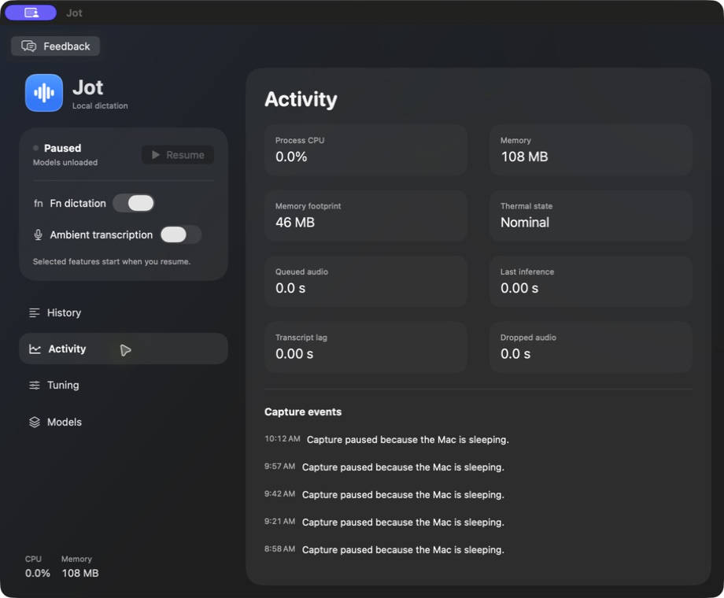
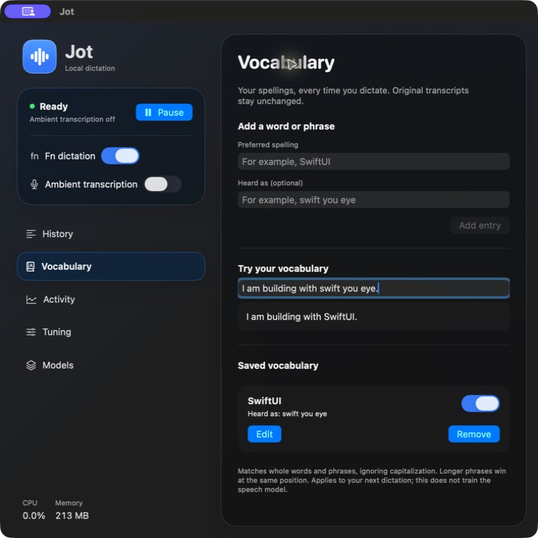
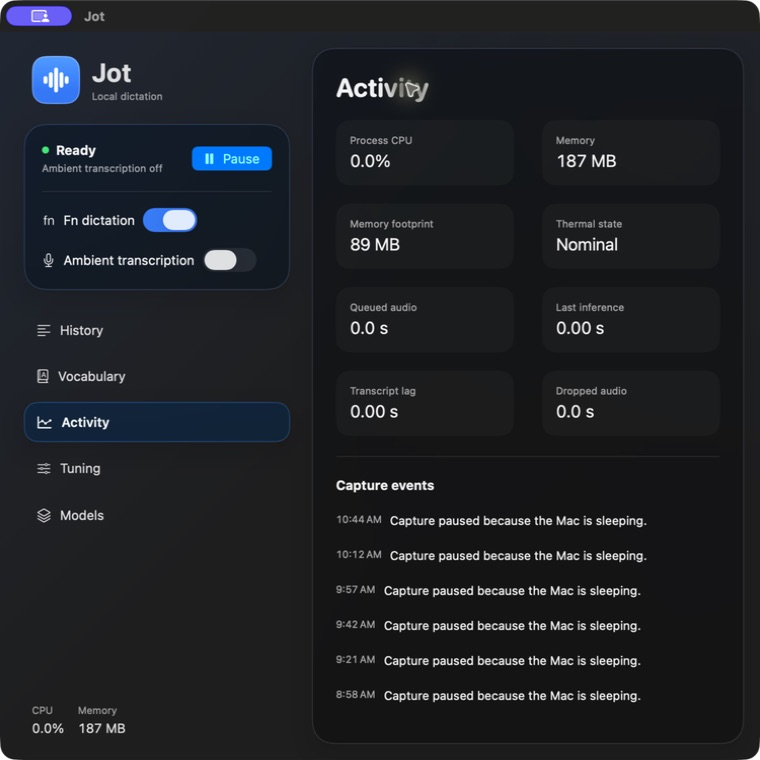

# Verification record

Initial implementation, 2026-09-06 on an Apple M5 Pro / 64 GB Mac running macOS 26.5.2, Xcode 26.6.

- `swift test`: 11 storage and Unix-transport tests passed. Covers persistence, search escaping, session labels, time ordering, journal pagination/validation, duplicate-service ownership, request bounds, and client/server round trips.
- Signed native Xcode build succeeded. Installer resolves its current product via `-showBuildSettings`, verifies the source and installed signatures, compares executable SHA-256, and confirms the installed process path. Machine-specific proof stays in ignored `build/install-proof.json`.
- Bundled CLI and MCP: initialize, 12-tool enumeration, live status, and capture-event reads passed; MCP stdout contained protocol frames only.
- FluidAudio models downloaded and loaded. A generated, approximately 8-second speech sample went through recognition and Sortformer in 0.40 seconds on the installed initial build. All intended words were returned, with Speaker 1. This is a functional smoke check, not a representative accuracy or sustained-performance benchmark. The diagnostic retained no transcript rows.
- Fn delivery: the initial attempt captured/transcribed but the user saw no insertion. After adding readback and fallback, the user confirmed it works. Installed status independently reported verified AX insertion into a Microsoft Edge text field; the 3.79-second utterance took 0.16 seconds for recognition. The final build additionally tags its own paste events so they cannot be mistaken for a physical Fn chord.

- Ambient microphone test: played the generated sample through the Mac speakers, captured 9.18 seconds, persisted one Speaker 1 segment containing the expected phrase, and paused successfully. Start/pause events persisted and no audio was dropped. Inference took 0.40 seconds. The first status poll was premature; status now computes pending queue duration directly, and pause starts the final queued inference immediately.

No previous application existed for a before screenshot. After-build screenshots use the native history-hidden state to keep actual microphone content out of this repository. No audio or personal transcripts are committed.

Still requires broader live use: Fn insertion in additional target apps (including Codex), speaker separation across real people, longer ambient use, and sleep/input-device recovery. The selected FluidAudio stack remains the implementation; these checks do not initiate a model comparison.

## Native UX revision

- Sixteen core tests pass, including generation-based pause cancellation, load failure/retry, and honest model-revision reporting.
- User confirmed that Pause reaches “Paused / Models unloaded” and menu-bar Open reuses one window.
- Installed lifecycle check: Resume immediately followed by Pause stayed paused; a subsequent Resume loaded models and completed the existing file diagnostic in 0.35 seconds, without playing audio. Final Pause reported models unloaded, Fn listener off, microphone off, and empty queues.
- Clicked the earlier test dictation in the native UI. The row showed Copied; pasting into the search field produced the exact same text, verifying clipboard contents without publishing actual ambient speech.
- The app's regular activation policy was checked while its single window was open. A single SwiftUI Window scene and disabled automatic tabbing replace the prior WindowGroup. Closing the window changes the app to accessory mode; menu-bar Open restores regular mode.
- Installed MCP exposes 15 tools; initialization, enumeration, and paused-service status passed. Model publication checks succeeded for all three upstream repositories. These checks do not establish the revision of previously downloaded cache files.
- The macOS 26 build uses native Liquid Glass surfaces/buttons. Earlier supported macOS versions use native material/button fallbacks. Model references are released on Pause; process/framework caches can remain resident, and actual Neural Engine utilization is not measured.

Before: the initial status window above. After: one native app containing controls, history, activity, and models. This screenshot is filtered to the earlier test phrase only.

## Human tuning follow-up

Twenty core tests pass. New cases cover a short filler with a spurious speaker score staying within one turn, sustained genuine speaker changes still splitting, adjustable confidence/paragraph pauses, and history filtering preserving source text. The installed Tuning page exposes presets and three bounded sliders plus filler-only row visibility. All inference inputs use a per-job settings snapshot; the current settings are returned by status. Film/reference alignment remains a manual short-scene check, described in TUNING.md.

Installed UI verification: clicking Steadier speakers changed the controls and CLI status to confidence 0.75, minimum turn 1.2 seconds, and paragraph pause 1.5 seconds. Incrementing the minimum-turn slider changed both UI and live status to 1.3 seconds. Balanced was restored afterward. The user's active ambient session was preserved; no playback or service restart was used for this check. The signed installed executable matches the checked build, with SHA-256 `e49d3fe2a94e30bc5099c4f36c2ba76a975e9531714657827488faa4b26ec2a1`.

## SwiftUI feedback and Finder access

- Branch `codex/swiftui-feedback` builds on the pushed speech implementation without changing the speech pipeline. DevFeedback is vendored unchanged from upstream commit `9ad898738b4e303c4001acc61db6de1e44112c0b` (package code finalized at `d2e0070`).
- All 20 speech tests and 5 feedback persistence/export tests pass. The complete Debug host is signed and installed. The complete Release host builds; the feedback package also builds in Release with no-op view modifiers.
- Current Xcode product: `build/DerivedData/Build/Products/Debug/Porch Speech.app`. The installer resolved this path from the current build settings, checked source and installed signatures, and verified matching executable SHA-256 `37217ab25aa659cf30c46ebdf1b70610f71a86484af8160e5b3ea3a7eaf1c7c9`. Installed process PID 83776 ran `/Applications/Porch Speech.app/Contents/MacOS/Porch Speech` at verification.
- After explicit user approval to replace the active app, capture was paused before installation. The installed app remains paused with Fn selected, ambient off, and models unloaded.
- A physical click on Fn in pick mode opened `service.fn` feedback without toggling Fn or starting capture. Switching from History to Tuning before capture produced `screen: tuning` and the correct source call site. Save & pick next, history edit/save, selected Markdown preview, and native JSON export all worked. The saved test note survived the final app replacement and remained available on a different screen.
- History → Open History in Finder selected the exact transcript SQLite file. Feedback → Show in Finder selected its app-scoped `history.json`. No history was deleted. A focused package test verifies that stale feedback sessions do not recreate records removed through Finder.
- Screenshots and the exported fixture below contain only an explicitly synthetic integration note or hidden transcript history. The feedback package does not automatically capture screenshots or view text.

[Synthetic selected JSON export](evidence/swiftui-feedback.json)

## Selecting multiple history statements

- Adds a native read-only NSTextView spanning all currently loaded statements, with Text/Cards selection remembered. Text is chronological; Cards retains individual copy and speaker naming. Search and Load more remain available.
- Signed Debug build installed from the product resolved by current Xcode settings. Built/installed signatures and executable hash match: `fcd426522eaa2da6aa9e1fa6cc29502fa4f874d160912455ae95e8ede857a628`. Installed process PID 85759 ran `/Applications/Porch Speech.app/Contents/MacOS/Porch Speech` during verification.
- The AppKit selection harness passed: an incoming update preserves selected text and its range, clearing the selection applies pending text, and a changed search replaces stale results/selection. No window or audio is opened by the harness. After building the host, run `swiftc -parse-as-library -F build/DerivedData/Build/Products/Debug -framework PorchCore -Xlinker -rpath -Xlinker "$PWD/build/DerivedData/Build/Products/Debug" Sources/PorchSpeech/SelectableHistory.swift scripts/check-history-selection.swift -o build/check-history-selection`, then `build/check-history-selection`.
- The Mac was initially locked during UI verification. After unlocking, the user tried the installed drag-and-copy flow and confirmed it works. A passive accessibility read independently showed Text selected and one continuous native transcript text area. An after screenshot is omitted because current history contains private content.
- Ambient listening and Fn were restored to their pre-install enabled state; installed status confirmed ready with microphone running.

## Jot rename — 2026-09-07

App, window, CLI/MCP identity, Swift modules, Xcode targets, bundle IDs, and current documentation now use Jot. Earlier records and screenshots above retain their historical names. The repository is public at https://github.com/StoneHub/jot.

All 20 core tests pass. The signed Debug product resolved by Xcode was installed as `/Applications/Jot.app`; built and installed executable hashes match, and the running process is `/Applications/Jot.app/Contents/MacOS/Jot`. Native accessibility and a history-hidden screenshot confirmed the Jot window and app menu. CLI status and help respond under `jot`.

Migration preserved all 596 transcripts across 7 sessions, Fn selection, tuning, and the feedback history file. The old app is archived under ignored `build/legacy-app-backup`. Jot remains paused. Its new bundle identity needs microphone and Accessibility permission; live dictation under the new identity has not been retested.

## Activity simplification

Removed the whole-Mac battery widget and its sampler. Activity shows Jot process metrics and capture events. The whole-Mac charge change did not measure Jot's energy use and duplicated macOS battery information.

## Glass UI and development feedback

The window and menu popover use native Liquid Glass on macOS 26, a restrained system-accent background, and material fallbacks on macOS 14–25. The battery widget and sampler are removed. History view-mode controls no longer wrap their label. The user reviewed the menu layout; the installed window was visually checked with system accent colors.

Debug feedback has no persistent toolbar or reserved padding. Developer commands and a shortcut activate picking/history. Child targets distinguish card mode labels, timestamps, text, copy indicators/actions, and speaker-name actions using opaque per-view keys and static labels. Physical picks verified the mode label, copy indicator, and parent whitespace independently. Those empty test drafts were discarded. The Developer menu and absence of idle feedback UI were verified through native accessibility. The keyboard shortcut activated picking. A native scroll action exposed offscreen target outlines over the header; an upstream viewport fix now clips drawing and hit testing, with regression tests for hidden and partial targets. The final live clipping check is pending because the Mac locked.

Twenty core tests and eight feedback tests pass. The feedback Release exclusion test passes. The signed Debug app was installed from Xcode's resolved product; source/installed executable hashes and running process path match. The app remains paused with permissions preserved.

A full signed Release build using the same final source passed the installer's DEBUG and feedback-runtime/metadata checks. The package may leave no-op API symbols; no capture panel, store, or row-target metadata is included. This is not a notarized distribution or another-Mac install test.

## App icon registration

Jot now includes the standard AppIcon asset catalog at all ten macOS sizes, alongside its bundled ICNS. Startup loads that bundled artwork explicitly while Launch Services refreshes. The running app's icon was read through NSRunningApplication and visually confirmed as Jot's waveform, replacing the generic placeholder. Generator output matches all ten catalog images. The final Debug and Release builds both passed signing and artifact checks.

## Personal vocabulary — 2026-09-07

- All 25 core tests pass, including five vocabulary tests for Unicode word boundaries, whitespace, capitalization, overlapping phrases, literal replacement, non-cascading behavior, disable/edit/remove, a stable in-flight value snapshot, validation, and preference persistence. Corrupt saved vocabulary is not overwritten on load failure.
- Signed Debug build installed from Xcode's resolved product at `build/DerivedData/Build/Products/Debug/Jot.app`. Source and installed executable SHA-256 match: `c5a709e3262d6643f501a00e73a03bc88ac914baa110633099af93a4bc2bbbf3`. The running process was verified at `/Applications/Jot.app/Contents/MacOS/Jot`.
- Native UI checks added `swift you eye` → `SwiftUI`, verified the preview, disabled/re-enabled it, edited the replacement, removed it, and restored it with Undo remove. The saved entry survived an app rebuild/relaunch. The final preview visibly and accessibly returned `I am building with SwiftUI.` The temporary entry and preview text were removed after capturing the screenshot.
- Debug picker selected the saved spelling and enable-switch child targets with static labels and opaque keys. The enable switch remained on and the preview stayed corrected after the picker click. The lexical checker reports only the existing mutually exclusive Text/Cards `history.load-more` declarations; new literal vocabulary targets are unique. The feedback package was not modified.
- The full signed Release build passed DEBUG and feedback-runtime checks, expanded to cover vocabulary target metadata. Release executable SHA-256: `3c8e99d9d0f5594abb33e9044d06705c88438e276fce186becf05b0d8cfa53d8`. This is build verification, not notarization or another-Mac installation proof.
- Source inspection confirms original transcripts are persisted before vocabulary is applied solely at dictation insertion. Fn remained enabled and ambient remained off; existing history was preserved. A controlled microphone-to-target insertion test specifically exercising a vocabulary replacement remains a user check; the installed preview exercises the same matcher without microphone capture.

The previous app had no vocabulary screen. This screenshot contains only the synthetic vocabulary example and preview, with no transcript history.

## Remove DevFeedback; keep diagnostics outside the UI — 2026-09-07

Removed the vendored feedback package, Xcode dependency, imports, commands, overlay modifiers, view tags, and feedback-only row key state. Updated project instructions and CI to enforce removal. Existing local feedback notes are left untouched; the installer no longer migrates them. Earlier records above describe historical builds.

Restored Activity to its previous metrics/events layout. The experimental memory graph and diagnostic UI are absent. Numeric performance history remains bounded in memory and accessible only through CLI/MCP; no automatic file collector or remote telemetry was added.

All 29 core tests passed, including sample cadence/capacity, stable startup and sampled peak, invalid samples, bounded event/job retention, percentile populations, and an allowlisted diagnostic export schema. Native UI inspection confirmed Activity's original layout and a menu bar containing Jot, Edit, View, Window, and Help, with no Developer menu. The source and signed Debug/installed Mach-O checks found no feedback runtime or metadata. Built/installed executable hashes matched and the running path was `/Applications/Jot.app/Contents/MacOS/Jot`.

The full signed Release build also passed the feedback-removal artifact guard and DEBUG exclusion check.

A live CLI report contained multiple samples plus launch, resume, model-load-started, and models-ready markers, with the Debug build label and no captured-content fields. Per-job timing math is tested; an actual spoken dictation under this new build has not been used as a controlled performance benchmark.

## Shared AppleFM cleanup — 2026-09-20

Jot now uses AppleFM for typed availability and native structured generation. The transcript schema, instructions, protected-token validation, entry count/order policy, 2400-byte input bound, greedy sampling, 1200-token response bound, two-second deadline, cancellation, and raw fallback remain in Jot. This starts from PR #31's live transcript replacement behavior.

- Final AppleFM revision: `737fac9e7147403f2777e0901f02452e8fc25ae7` (merged framework PR #1; identical file tree to the worker-tested revision), pinned in both package manifests, the generated Xcode project, and both resolution files. No local dependency override remains.
- `swift test`: all 126 tests passed against the remotely fetched dependency. Added coverage checks exact raw fallback after errors, the combined UTF-8 boundary, no overlapping generation after dictation interruption, and original text preservation after derived text updates and reopening storage. Existing timeout/no-backlog and live replacement tests pass.
- `./scripts/build-install.py --configuration Release --build-only`: passed. The current resolved app is `build/DerivedData.noindex/Build/Products/Release/Jot.app`; signing, strict bundle verification, DEBUG exclusion, and feedback exclusion passed. Its bundled `jot --help` ran successfully.
- Mach-O inspection reports minimum macOS 14.0 for Jot, JotCore, and the bundled CLI, with weak FoundationModels linkage in JotCore. An actual macOS 14 runtime was not available.
- A standalone harness linked to the built JotCore exercised `TranscriptCleanup.clean` with two synthetic entries. Valid changed output arrived in 1.26 seconds with a 15-second diagnostic allowance, then 0.83 seconds with the normal two-second deadline. A shorter initial fixture was returned unchanged by both shared and original direct native generation; it did not establish changed-output behavior. No captured transcripts were used.
- Independent review found no behavior issues; its missing root lockfile finding was resolved. No installed app was replaced or restarted during this validation. Installed/runtime delivery and public distribution remain separate.

Parent final review: both resolution files and both build systems use the merged framework revision. All 126 tests and the signed Release build passed again after resolving that final pin. Framework tree equality was verified before reusing the live synthetic generation evidence.

## Continuous listening and dictation recovery — 2026-09-20

Resume now starts the microphone; Pause stops new capture, saves pending recognition, and unloads. There is no separate Ambient switch. Held dictation is a persisted delivery attempt over the continuous recognition timeline, not a separate audio buffer with a 60-second cancellation. Double-tap retries the newest undelivered attempt, otherwise inserts the configurable recent window (default two minutes), including all voices.

- `swift test`: 150 tests passed, including gesture arbitration, partial-attempt persistence, schema 6-to-7 migration, interrupted attempts, recovery-window edges, deletion, wake intent, and cleanup outcomes.
- `JotRecoveryChecks` exercises the real controller with a temporary SQLite database and injected inference/delivery. A 75-second hold persists each chunk before release; failed delivery survives reopening; short taps retain the older failed attempt; recovery inserts it once; recent recovery includes pending audio; Pause saves its half-second tail. An injected recognition failure retains marked partial text without automatic insertion. Disabling dictation retains it. A capture check drives Resume with a microphone that refuses to start: two refusals recover on the third try, a device that never returns stops after the last retry with the notice naming it, a shortcut press then says the microphone is off, and Resume restarts capture with the models already loaded.
- Delayed cleanup verification: raw text appears before cleanup, a second recognition job completes while the first cleanup is running, the first row is replaced by cleaned text, and the busy-model fallback retains the second raw row. Counters explain applied and bypassed cleanup without exposing transcript contents.
- Failure regressions also cover a zero-sample final barrier failing to recognize its retained tail (for held dictation and recent recovery), and Pause during model preparation or failed preparation. Partial text remains saved without an initial automatic insertion; an explicit subsequent recovery may insert it with a partial-text notice.
- The real-model harness uses generated speech, never personal recordings. Isolated three-second chunks lost words. A two-second left-only overlap introduced duplicates and was rejected. The implemented bounded context/tail path keeps short updates and flushes pending words at explicit boundaries. Local logs are in ignored `build/`.
- Final fixture comparison: full-file recognition of 57.43 seconds took 2.24 seconds. The same passage repeated twice (114.85 seconds) ran through 40 streaming jobs, including an empty final flush, in 8.56 seconds of accelerated harness time. Both passages survived without the prior six seam-word duplicates. Punctuation and ordinary ASR wording still differed. This measures processing a fixture, not wall-clock live display latency. Deterministic checks cover the seven-second window bound, final-tail flush, boundary deduplication, genuine repeated words, and resets.

The harness does not establish physical Fn timing, target-app Accessibility behavior, or real conversational accuracy. Those remain live-use checks. Force-quit preserves committed recognition, not an unrecognized audio tail. No new raw-audio recovery file or public release is introduced.

## Phrase cleanup and visible replacement — 2026-09-20

The fragment-level model contract could leave short Live rows unchanged or fail its exact-entry-count check. Cleanup now submits one assembled phrase, then maps the result back to the original row IDs. Recognition still publishes first.

- `swift test`: 154 tests pass, including phrase boundaries, source-ID preservation, filler-only row removal, protected numbers, atomic derived writes, and deletion during cleanup.
- `JotRecoveryChecks --cleanup-model`: the real controller publishes three synthetic recognition fragments, then the actual on-device Foundation Model removes “uh” from the joined sentence and persists the replacement. No microphone or personal transcript was used. The delayed model check verifies both queued phrases eventually clean while recognition continues; this supersedes the busy-second-row fallback result recorded above.
- `swiftc -parse-as-library Sources/Jot/LiveTranscriptText.swift scripts/check-live-text.swift -o build/check-live-text && build/check-live-text`: native AppKit checks pass for immediate raw additions, unchanged selected text and selection range, cleanup after selection release, and Reduce Motion. This verifies transition scheduling, not a human-observed animation.
- `./scripts/build-install.py --configuration Release --build-only`: signed Release build passes strict signing, DEBUG exclusion, and feedback exclusion. Xcode resolves the product under `build/DerivedData.noindex/Build/Products/Release/Jot.app`.

Local logs live in ignored `build/phrase-all-tests.log`, `build/phrase-real-model-check.log`, and `build/phrase-release.log`. Installed/runtime proof is recorded separately by the installer. No before/after screenshot of personal Live content is published; visual animation acceptance remains a live-use check.

## Cleanup deadline per call site and a visible replacement mark — 2026-09-21

One two-second deadline covered both cleanup call sites. Measured on-device latency rises with phrase length, so live phrases exceeded it and were dropped. The deadline is now set per call site, and a replaced line is marked in the accent color rather than by a crossfade alone.

- Latency measured against the on-device Foundation Model, three trials per size, with a sixty-second ceiling so no trial was cut short. Median times were 1.9 seconds at 118 bytes, 2.9 at 299 bytes, 3.0 at 595 bytes, 4.4 at 1000 bytes, 9.1 at 1499 bytes, and 8.3 at 1992 bytes. Jot was listening in ambient mode throughout, so the figures include normal contention for the model. The synthetic inputs repeated one sentence, which the model collapsed. Their cleanup outcomes therefore say nothing about real speech. Only the timings are used here.
- A live phrase carries up to 2000 bytes, so it needs about nine seconds. `SpeechServiceDependencies.cleanup` now takes a duration. Live phrases get twelve seconds. Dictation rows keep two, which fits a single row.
- `swift test`: 154 tests pass.
- `JotRecoveryChecks --cleanup-model`: nine checks pass, including the real Foundation Model cleaning three published fragments as one phrase and persisting the replacement.
- `swiftc -parse-as-library Sources/Jot/LiveTranscriptText.swift scripts/check-live-text.swift -o build/check-live-text && build/check-live-text`: the existing checks pass, and two added assertions confirm the replaced line receives the accent wash and that Reduce Motion suppresses both the wash and the crossfade.
- `./scripts/build-install.py --configuration Release`: signed Release build passes strict signing, DEBUG exclusion, and feedback exclusion, and installs. The installer refuses to replace the app while capture is running, so Pause first.

A cleaned line now washes in the system accent color at 32 percent opacity, fading to clear over 1.1 seconds, alongside a 0.28-second crossfade. Wording often changes very little, and a crossfade between two nearly identical strings reads as a flicker. The wash outlasts the crossfade so the change is visible without staring at the line. Reduce Motion and an active selection still suppress it.

The measurement above covers model latency, not conversation. Whether the longer deadline lowers the timeout rate in ordinary speech remains a live-use check. A longer deadline also means a long phrase can be replaced several seconds after it was spoken, by which time the line may have scrolled out of view. The phrase size cap is unchanged. As before, the checks verify that the animation is scheduled, not that a person noticed it.
