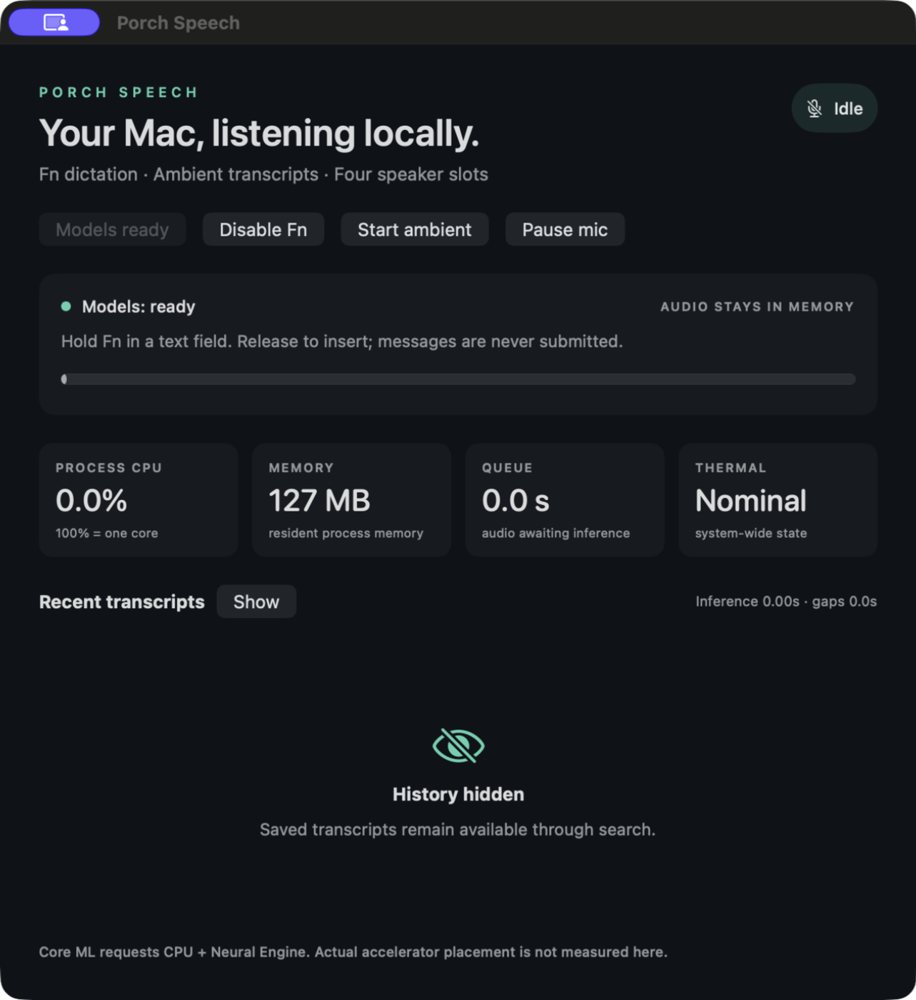
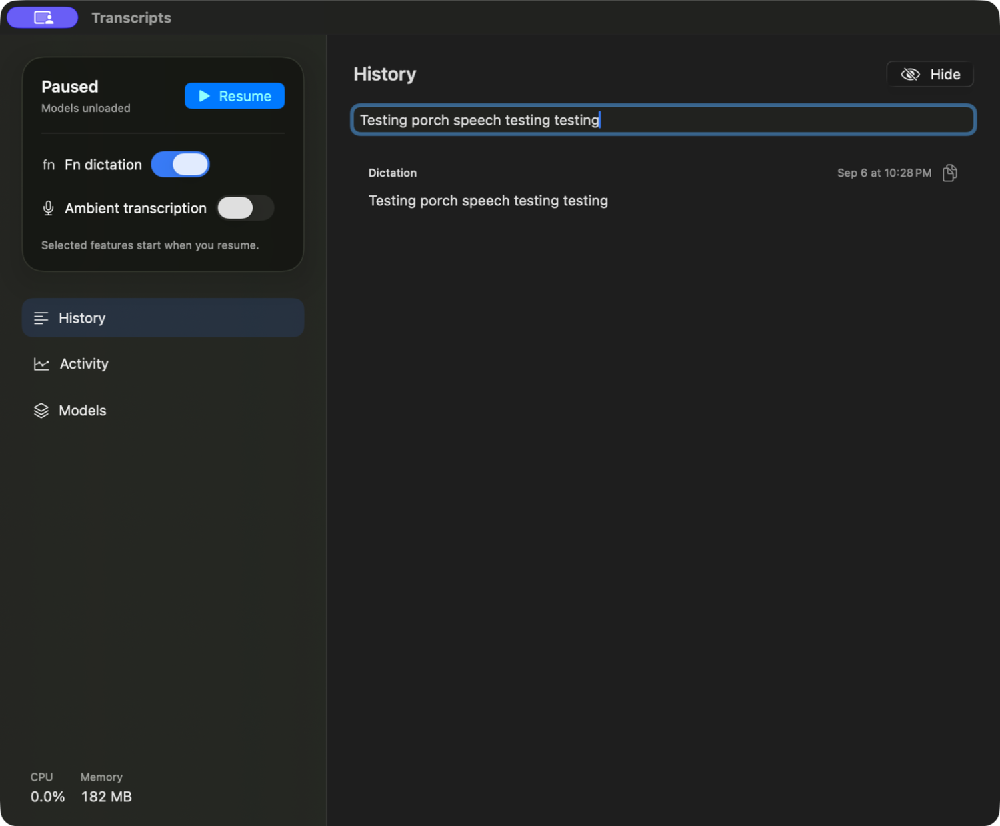

# Verification record

Initial implementation, 2026-09-06 on an Apple M5 Pro / 64 GB Mac running macOS 26.5.2, Xcode 26.6.

- `swift test`: 11 storage and Unix-transport tests passed. Covers persistence, search escaping, session labels, time ordering, journal pagination/validation, duplicate-service ownership, request bounds, and client/server round trips.
- Signed native Xcode build succeeded. Installer resolves its current product via `-showBuildSettings`, verifies the source and installed signatures, compares executable SHA-256, and confirms the installed process path. Machine-specific proof stays in ignored `build/install-proof.json`.
- Bundled CLI and MCP: initialize, 12-tool enumeration, live status, and capture-event reads passed; MCP stdout contained protocol frames only.
- FluidAudio models downloaded and loaded. A generated, approximately 8-second speech sample went through recognition and Sortformer in 0.40 seconds on the installed initial build. All intended words were returned, with Speaker 1. This is a functional smoke check, not a representative accuracy or sustained-performance benchmark. The diagnostic retained no transcript rows.
- Fn delivery: the initial attempt captured/transcribed but the user saw no insertion. After adding readback and fallback, the user confirmed it works. Installed status independently reported verified AX insertion into a Microsoft Edge text field; the 3.79-second utterance took 0.16 seconds for recognition. The final build additionally tags its own paste events so they cannot be mistaken for a physical Fn chord.

- Ambient microphone test: played the generated sample through the Mac speakers, captured 9.18 seconds, persisted one Speaker 1 segment containing the expected phrase, and paused successfully. Start/pause events persisted and no audio was dropped. Inference took 0.40 seconds. The first status poll was premature; status now computes pending queue duration directly, and pause starts the final queued inference immediately.

No previous application existed for a before screenshot. After-build screenshots use the native history-hidden state to keep actual microphone content out of this repository. No audio or personal transcripts are committed.

Still requires broader live use: Fn insertion in additional target apps (including Codex), speaker separation across real people, longer ambient use, and sleep/input-device recovery. The selected FluidAudio stack remains the implementation; these checks do not initiate a model comparison.

## Native UX revision

- Sixteen core tests pass, including generation-based pause cancellation, load failure/retry, and honest model-revision reporting.
- User confirmed that Pause reaches “Paused / Models unloaded” and menu-bar Open reuses one window.
- Installed lifecycle check: Resume immediately followed by Pause stayed paused; a subsequent Resume loaded models and completed the existing file diagnostic in 0.35 seconds, without playing audio. Final Pause reported models unloaded, Fn listener off, microphone off, and empty queues.
- Clicked the earlier test dictation in the native UI. The row showed Copied; pasting into the search field produced the exact same text, verifying clipboard contents without publishing actual ambient speech.
- The app's regular activation policy was checked while its single window was open. A single SwiftUI Window scene and disabled automatic tabbing replace the prior WindowGroup. Closing the window changes the app to accessory mode; menu-bar Open restores regular mode.
- Installed MCP exposes 15 tools; initialization, enumeration, and paused-service status passed. Model publication checks succeeded for all three upstream repositories. These checks do not establish the revision of previously downloaded cache files.
- The macOS 26 build uses native Liquid Glass surfaces/buttons. Earlier supported macOS versions use native material/button fallbacks. Model references are released on Pause; process/framework caches can remain resident, and actual Neural Engine utilization is not measured.

Before: the initial status window above. After: one native app containing controls, history, activity, and models. This screenshot is filtered to the earlier test phrase only.

