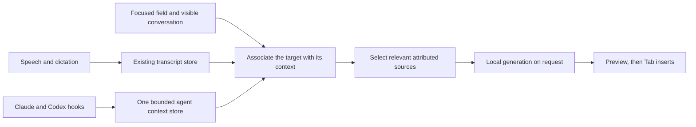

# Jot: context, state, and the next useful slice

Reviewed September 27, 2026, against `bcc1320` and open PRs #136–#138. This is the review requested by [#142](https://github.com/StoneHub/jot/issues/142), not a claim that the proposed work is installed.

Jot's next priority is trustworthy inputs. Monroe reports that dictation and ambient capture have been reliable. Keep hold-Fn dictation, double-tap-Fn requests, and Tab acceptance. Do not put the old recovery work or a complete architecture rewrite ahead of connecting the context he is already using.

## Product direction

Jot can be the local place where spoken intent, the current field, and an agent conversation meet. Each source should retain who said it, where it came from, which conversation it belongs to, and when it becomes stale. A request selects that evidence and gives the local model a small, coherent input. The resulting text is a preview that Monroe chooses to insert.

Apple's on-device model already handles cleanup and suggestions; the speech pipeline uses FluidAudio. Additional local models should be tried against the same captured synthetic scenarios after source selection matches production. A larger generator cannot repair mixed conversations or an assistant claim presented as the user's intent. No new inference backend is needed for this first slice.

## What the recent work accomplished

The latest Claude work made substantial progress: live per-key settings, a listening-state enum, speaker names that remember voices, fewer redundant UI publications, clearer no-suggestion notices, and recognition padding that preserves short final chunks. The checkpoint records unfinished branches and remaining checks instead of treating them as delivered.

The performance investigation behind [#107](https://github.com/StoneHub/jot/pull/107) is particularly useful: it separates measured service work from inferred UI cost and includes a baseline that fails the new check. Subsequent ownership changes weakened that particular redraw check; [#126](https://github.com/StoneHub/jot/issues/126) captures the follow-up. Keep the measurement discipline, update the observation boundary.

The main weakness is integration across parallel work. #132 and #137 independently introduced overlapping stores. The evaluation harness and production selector use different bounds and association policies. Passing a result-file validator is not a semantic quality score: #136's evaluation records a finished-sentence continuation that restates the assistant's status and invents a next step.

## Measurements

Read-only measurements on September 27; live counts and data size can increase while listening. MiB means 1,048,576 bytes. No transcript text or recorded audio is included here.

| Item | Observed |
| --- | ---: |
| Installed app bundle | 25.17 MiB |
| FluidAudio model cache, outside the bundle | 712.07 MiB |
| Jot application data | 217.84 MiB |
| SQLite main file, excluding WAL | 11.59 MiB |
| Transcript rows | 6,583 |
| Remembered People | 0 |
| App Swift source | 6,846 lines / 35 files |
| Core Swift source | 5,257 lines / 51 files |
| Swift test source | 4,948 lines / 47 files |
| Published properties in SpeechService | 33 |
| Agent messages held by the running app | 0 |

The bundle and database are not currently oversized. Temporary speaker-pass audio is the dominant growing file. `SessionAudioFile.byteLimit` already caps each file at two hours of mono 16 kHz Float32: 460,800,000 bytes, about 439.45 MiB. A longer session retains only those first two hours for the pass. The earlier #142 projection of a 690 MB three-hour file missed this cap. Compression is a later measured tradeoff, not this week's input prerequisite.

State ownership is the larger maintenance concern. Removing Host protocols made the code easier to follow, but owned components still reach through `SpeechService`, and settings have both stored values and published copies. Fix those boundaries when changing the associated behavior; avoid another whole-app refactor as a prerequisite.

## Five ranked recommendations

1. **Connect Claude and Codex through one store, with conversation identity.** Finish [#134](https://github.com/StoneHub/jot/issues/134) and the necessary part of [#139](https://github.com/StoneHub/jot/issues/139) together. Adapt #137's integration to `AgentContext`; do not retain a second conversation store. Bound payloads and retention, deduplicate repeated events, preserve source/session/role, and reject ambiguous conversation matches. An ordinary Messages field must not automatically receive recent coding-agent chats. Clearing or replacing context must invalidate a preview that used it.
2. **Make input selection observable and evaluate the production path.** [#135](https://github.com/StoneHub/jot/issues/135) should record source counts, exclusion reasons, timings, and outcomes without text. [#140](https://github.com/StoneHub/jot/issues/140) should first make the harness use the app's limits and policy, then rank relevant context ahead of merely recent speech. Test two simultaneous conversations, duplicated hook events, a noisy video after a spoken reply, and an unrelated destination.
3. **Keep a stable identity record.** [#141](https://github.com/StoneHub/jot/issues/141) should separate the user's learned voice from disposable session storage. Monroe accepts the current Fn-overlap heuristic's limitations while that identity is absent; it does not block #136. Whether named People also survive rebuilds remains an explicit product decision. Before any further format-changing launch, fix the process ownership ordering in [#121](https://github.com/StoneHub/jot/issues/121): the app opens/rebuilds SQLite before its socket single-instance guard starts.
4. **Make exported context stay correct as history changes.** [#122](https://github.com/StoneHub/jot/issues/122) is needed before agents treat `transcripts.since` as a faithful replica. Splits, deletes, speaker renames, and database generations need an explicit change contract. This outbound integration is distinct from hooks contributing context to Jot.
5. **Deepen the modules when the input slice exposes a need.** Prioritize bounded AX work and off-main store calls ([#129](https://github.com/StoneHub/jot/issues/129), [#63](https://github.com/StoneHub/jot/issues/63)), then one settings path and explicit observable ownership ([#124](https://github.com/StoneHub/jot/issues/124), [#125](https://github.com/StoneHub/jot/issues/125)). [#65](https://github.com/StoneHub/jot/issues/65) is useful cleanup and concurrency work, not a reason to withhold an independently tested integration.

## Open PR disposition

| PR | Disposition |
| --- | --- |
| [#136](https://github.com/StoneHub/jot/pull/136), continuation and speech grouping | Useful continuation behavior. Monroe accepts overlapping voices as a current limitation; do not add a voice-recognition prerequisite. Preserve the documented semantic generation failures as follow-up evidence. Existing checks were reported by the author; this review did not rerun them. |
| [#137](https://github.com/StoneHub/jot/pull/137), Claude context | Rework against current main and the existing store. Avoid broad recent-session fallback and transcript-tail parsing. Add Codex ingress through the same contract. |
| [#138](https://github.com/StoneHub/jot/pull/138), heard-speech rewrite | Finish after context association. Rebase deliberately because coordinator/context code and the v5 prompt identifier overlap #136. Full checks and quality evaluation remain required. |

Current official [Claude hook documentation](https://code.claude.com/docs/en/hooks#stop-input) and [Codex hook documentation](https://learn.chatgpt.com/docs/hooks) both provide `last_assistant_message` for Stop. Prefer that payload to a saved-transcript parser. Claude explicitly warns that the final message may not yet be in the transcript at Stop time. Hooks should be quiet, bounded, and tolerate Jot being unavailable. Desktop hook firing is a separate runtime check; a tested JSON fixture does not prove that a plugin is active in the Code tab or Codex app.

## Complete open-issue map

All 27 issues were open at review time. Existing issue comments retain their detailed acceptance criteria.

| Issues | Next action / ordering |
| --- | --- |
| [#134](https://github.com/StoneHub/jot/issues/134), [#139](https://github.com/StoneHub/jot/issues/139) | First implementation: one hook ingress store and conversation association. |
| [#135](https://github.com/StoneHub/jot/issues/135), [#140](https://github.com/StoneHub/jot/issues/140) | Next: input diagnostics, production-matched evaluation, relevance. |
| [#141](https://github.com/StoneHub/jot/issues/141) | Durable user voice and a Forget control; decide survival of named People. |
| [#121](https://github.com/StoneHub/jot/issues/121) | Process lock before the next database format change or another live app launch. |
| [#122](https://github.com/StoneHub/jot/issues/122) | Complete outbound change-feed semantics before building a follower. |
| [#142](https://github.com/StoneHub/jot/issues/142) | This report supplies measurements and ranked recommendations; implementation belongs in separate PRs. |
| [#79](https://github.com/StoneHub/jot/issues/79), [#90](https://github.com/StoneHub/jot/issues/90) | Product umbrellas. Keep request-only interaction; land context work before managed Terminal integration and further drafting changes. |
| [#129](https://github.com/StoneHub/jot/issues/129), [#63](https://github.com/StoneHub/jot/issues/63), [#123](https://github.com/StoneHub/jot/issues/123) | Focused responsiveness lane: bounded AX reads, off-main store/shortcut work, measure from the actual key timestamp. |
| [#124](https://github.com/StoneHub/jot/issues/124), [#125](https://github.com/StoneHub/jot/issues/125), [#126](https://github.com/StoneHub/jot/issues/126) | Settings and ownership cleanup, with redraw checks observing the real publishers. Several stale-screen symptoms already received #119 fixes; verify remaining cases before reworking them. |
| [#127](https://github.com/StoneHub/jot/issues/127) | Narrow-window onboarding visibility fix; independent, small UI lane when encountered. |
| [#128](https://github.com/StoneHub/jot/issues/128), [#65](https://github.com/StoneHub/jot/issues/65) | Remove genuinely unused automatic-trigger code and clarify type/concurrency boundaries. Preserve double-Fn, Tab, continuation, and scope fields used by active work. |
| [#130](https://github.com/StoneHub/jot/issues/130) | Reconcile old task logs and current design after the open branches land. Keep evidence until its replacement is usable. |
| [#59](https://github.com/StoneHub/jot/issues/59) | CLI tuning lab once input contracts and settings are stable enough to compare runs. |
| [#39](https://github.com/StoneHub/jot/issues/39) | Field-aware dictation style after settings and latency measurement. |
| [#37](https://github.com/StoneHub/jot/issues/37) | Live speaker passes after identity and tuning; account for split events in #122. |
| [#38](https://github.com/StoneHub/jot/issues/38) | Meeting notes after reliable attribution and evaluation. |
| [#42](https://github.com/StoneHub/jot/issues/42) | Vocabulary suggestions from cleanup corrections; independent later feature. |
| [#40](https://github.com/StoneHub/jot/issues/40) | Calendar naming remains deferred. |
| [#33](https://github.com/StoneHub/jot/issues/33) | Proximity remains parked. |

## Coordination for this slice

One orchestrator owns scope, shared contracts, review, and integration. Sol workers own coherent feature changes in isolated worktrees. A Luna worker can gather bounded context, classify issues, or check a precise test matrix. Do not have multiple workers independently redesign `SuggestionCoordinator` or the context store. Compile and integrate shared-code changes serially. A passing worker branch is ready for integration; the installed build and Monroe's end-to-end use remain separate evidence.

No capture, preferences, database, hook configuration, or installed app was changed to produce this review.
